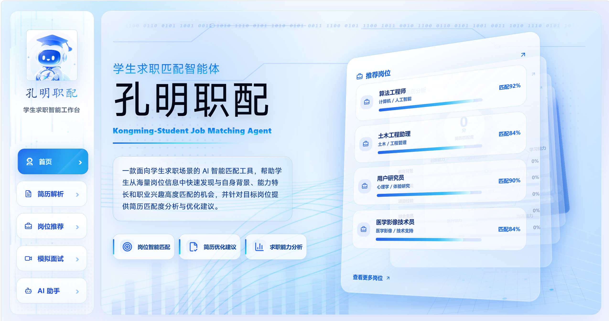
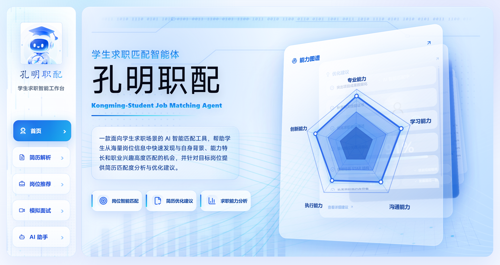
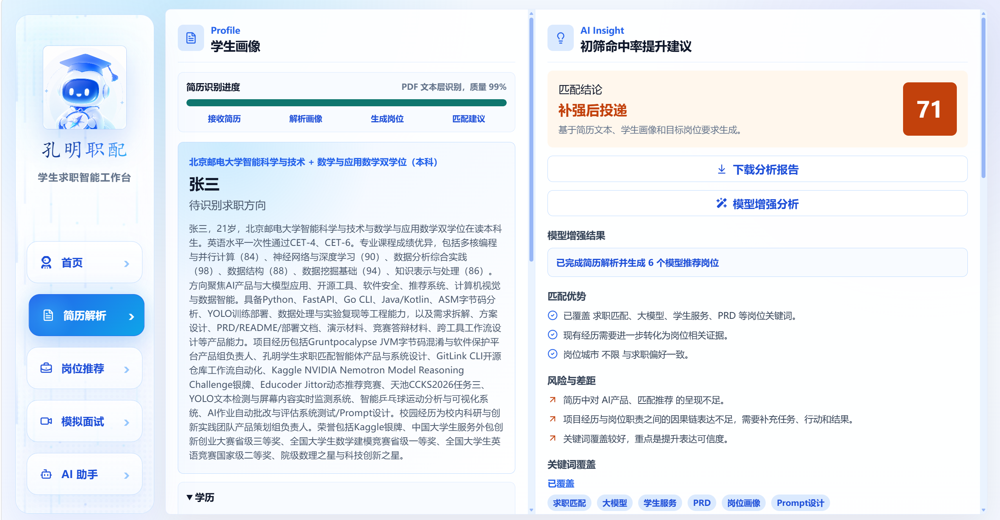
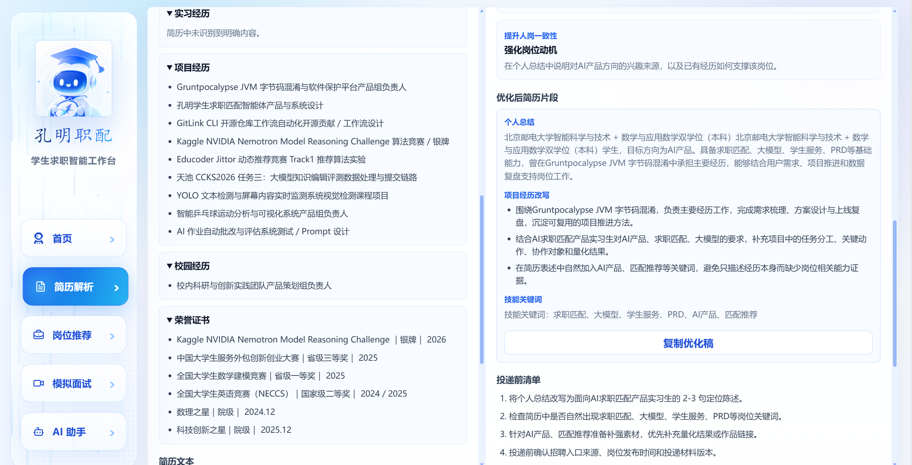
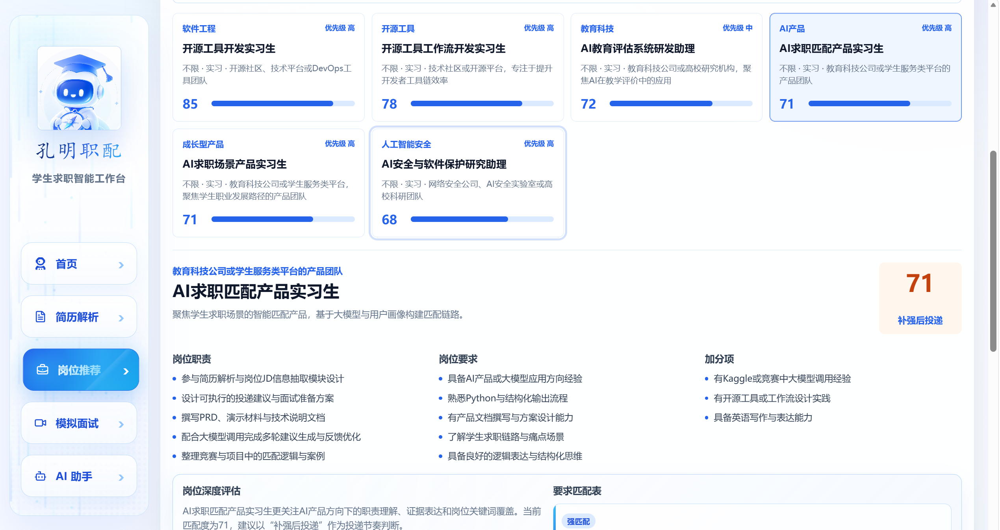
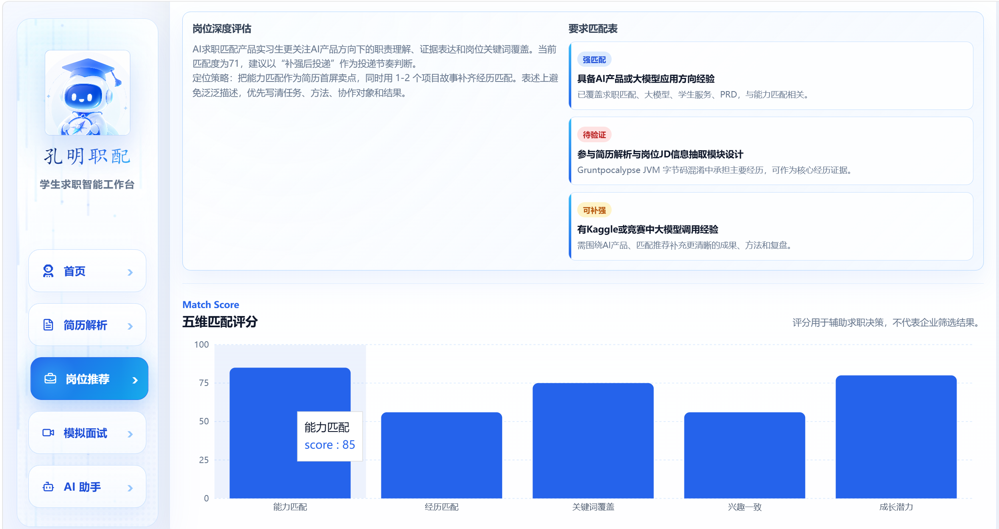
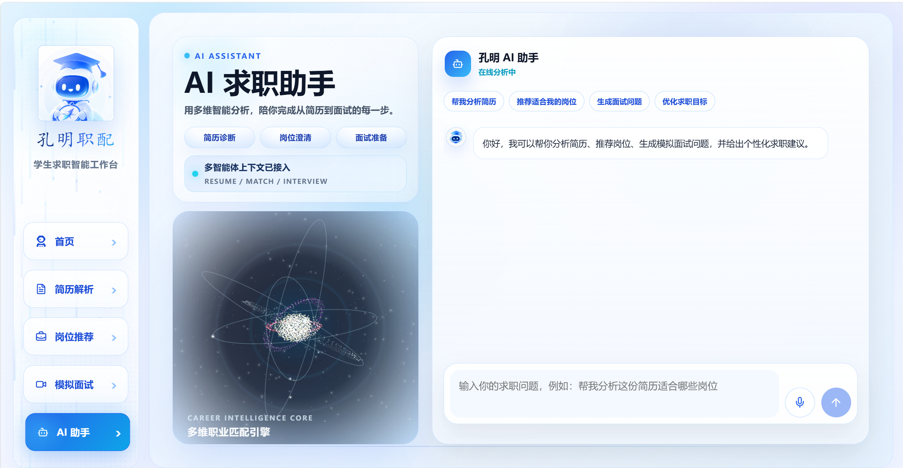
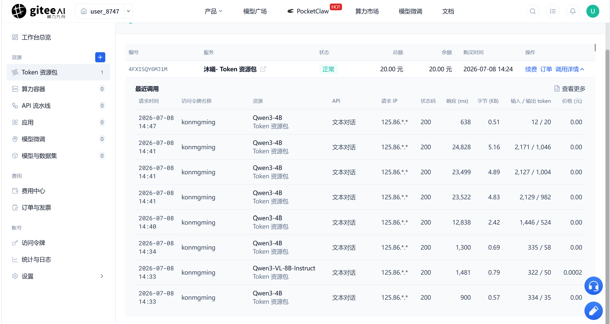

# Kongming Student Job Matching Agent

孔明职配是面向学生求职场景的 AI 岗位匹配与简历优化智能体。项目通过简历解析、岗位推荐、JD 分析、匹配解释、简历优化建议、模拟面试和 AI 求职助手，帮助学生完成从“理解自身画像”到“准备投递材料”的求职分析闭环。

## 项目简介

难以判断岗位与自身经历是否匹配是学生在求职过程中常见的问题，同时学生也缺少面向目标 JD 的具体简历优化建议。孔明职配将简历、岗位 JD、面试回答和用户追问统一到一个求职上下文中，使用轻量多智能体流程和模型代理生成可解释结果。

当前仓库已实现 Web Demo，主要面向以下场景：

- 学生上传或粘贴 PDF、图片、文本简历。
- 系统结构化提取学生画像、经历证据、技能和求职方向。
- 系统生成岗位推荐，并给出匹配评分、关键词覆盖、风险和行动建议。
- 用户粘贴目标 JD 后进行二次分析。
- 用户进入模拟面试，获得面试追问和反馈。
- 用户通过 AI 助手进行连续求职问答。

## 核心功能

| 功能 | 当前实现 |
| --- | --- |
| 简历输入 | 支持文本文件、PDF、图片简历；PDF 优先读取文本层，质量不足时转视觉识别。 |
| 简历结构化 | 通过模型任务 `resume-structure` 提取姓名、学历、经历、技能、求职方向等字段。 |
| 岗位推荐 | 通过并行岗位发现子任务生成候选岗位，并在前端去重、排序。 |
| 本地匹配评分 | `src/matchEngine.ts` 基于能力、经历、关键词、兴趣和成长潜力生成可解释评分。 |
| JD 分析 | 支持用户输入岗位名称和 JD，生成岗位结构、投递优先级、优势、风险和行动建议。 |
| 简历优化 | 根据目标岗位和匹配差距生成个人总结、项目经历改写和技能关键词建议。 |
| 模拟面试 | 支持综合面、技术面、HR 面三种模式，包含语音输入、TTS 播报、Live2D/PNG 面试官兜底。 |
| AI 求职助手 | 支持多轮对话，带入简历、岗位和匹配结果上下文。 |
| 报告导出 | 可导出 Markdown 分析报告。 |

## 使用的模型与算力环境

当前代码中的模型调用由后端代理统一封装：

- 前端调用：`src/arkClient.ts`
- 开发环境代理：`vite.config.ts` 中的 `/api/ark`
- Vercel API：`api/ark.js`
- 核心模型调用：`server/arkCore.js`

当前默认配置为 Ark 兼容接口：

```text
ARK_BASE_URL=https://ark.cn-beijing.volces.com/api/v3
ARK_API_KEY=your_model_api_key
ARK_REQUEST_TIMEOUT_MS=65000
```

默认模型常量为 `doubao-seed-2-0-lite-260215`，同时已支持通过环境变量切换到 Gitee AI / 沐曦 Token 资源包。当前真实调用环境使用 `https://ai.gitee.com/v1`、资源包 `1492`、文本模型 `Qwen3-4B` 和视觉模型 `Qwen3-VL-8B-Instruct`，并已补充脱敏调用记录与截图证据。

## 仓库结构

```text
.
├── api/                         Vercel API 入口，转发模型请求
├── docs/                        项目架构、技术说明、部署、证据与运行文档
├── public/                      静态资源、Live2D/2D 面试官、PDF.js CMap
├── scripts/                     解析器与 UI 验证脚本
├── server/                      服务端模型代理核心逻辑
├── src/                         React 前端、智能体、解析器、页面和样式
├── index.html                   Vite HTML 入口
├── package.json                 Node 依赖和脚本
├── vite.config.ts               Vite 配置和本地 API 代理
├── vercel.json                  Vercel 安全头配置
└── tsconfig.json                TypeScript 配置
```

更完整的结构说明见 [项目架构与理解文档](docs/PROJECT_ARCHITECTURE_AND_UNDERSTANDING.md)。

## 快速开始

环境要求：

- Node.js 版本建议使用当前 Vite 7 可兼容版本，推荐 Node.js 20 或更新版本。
- npm。

安装依赖：

```bash
npm install
```

本地开发：

```bash
npm run dev
```

浏览器访问 Vite 输出的本地地址，默认通常为：

```text
http://localhost:5173
```

构建：

```bash
npm run build
```

预览构建产物：

```bash
npm run preview
```

## 配置说明

| 配置项 | 是否必填 | 用途 | 示例 |
| --- | --- | --- | --- |
| `ARK_API_KEY` | 模型能力必填 | 服务端模型代理鉴权 | `your_model_api_key` |
| `ARK_BASE_URL` | 否 | 覆盖默认 Ark 兼容接口地址 | `https://ark.cn-beijing.volces.com/api/v3` |
| `ARK_MODEL` | 否 | 文本任务模型名称 | `Qwen3-4B` |
| `ARK_VISION_MODEL` | 否 | 图片/PDF 视觉兜底模型名称 | `Qwen3-VL-8B-Instruct` |
| `ARK_PACKAGE` | 否 | Gitee AI / 沐曦 Token 资源包编号 | `1492` |
| `ARK_REQUEST_TIMEOUT_MS` | 否 | 服务端模型请求超时时间 | `65000` |
| `VITE_ARK_API_URL` | 否 | 前端覆盖模型代理地址 | `/api/ark` |
| `VITE_AVATAR_MODE` | 否 | 数字人模式标记 | `static` |


## 示例输入输出与运行流程

以下示例基于已脱敏的演示数据，展示从首页入口到简历分析、岗位推荐、模拟面试和 AI 助手的完整使用链路。

示例输入：学生简历 PDF、图片或文本内容，以及可选的目标岗位名称/JD。

示例输出：结构化学生画像、岗位推荐列表、岗位匹配评分、简历优化建议、模拟面试追问和 AI 助手多轮问答回复。

### 1. 首页与能力入口

首页展示项目定位、核心能力入口和岗位推荐/能力图谱预览。





### 2. 简历解析与优化建议

用户上传或粘贴简历后，系统提取学生画像、项目经历、技能关键词和求职方向，并基于目标岗位生成简历优化建议。





### 3. 岗位推荐与匹配解释

系统根据学生画像生成岗位推荐列表，给出匹配分数、优先级、岗位职责、岗位要求和五维匹配评分。





### 4. 模拟面试与 AI 助手

用户可以进入综合面、技术面或 HR 面模拟面试，也可以在 AI 助手中围绕简历诊断、岗位澄清、面试准备进行多轮问答。




### 5. 模型真实调用记录

项目已通过 Gitee AI / 沐曦 Token 资源包完成真实模型调用。下图为脱敏后的控制台调用记录，不包含访问令牌、Authorization header、Cookie 或完整 IP。



## 部署方法

当前项目包含 Vercel API 入口和 `vercel.json` 安全头配置，适合部署到 Vercel。

基本流程：

1. 在部署平台连接仓库。
2. 配置构建命令：`npm run build`。
3. 配置输出目录：`dist`。
4. 在部署平台配置 `ARK_API_KEY` 等环境变量。
5. 部署后访问公网链接并验证简历上传、岗位推荐、JD 分析和模拟面试流程。

详细步骤见 [部署指南](docs/DEPLOYMENT_GUIDE.md)。

## 证据材料

仓库已补充核心页面运行截图、模型真实调用证据、脱敏日志说明和性能测试记录。材料清单见 [证据材料索引](docs/EVIDENCE_INDEX.md)，整理说明见 [演示材料与证据指南](docs/DEMO_AND_EVIDENCE_GUIDE.md)。

## 性能测试与运行日志

仓库当前包含：

- `scripts/verify-parsers.cjs`：解析器验证脚本。
- `scripts/verify-ui.cjs`：Playwright UI 验证脚本，使用 Mock `/api/ark` 响应。

仓库已补充 Gitee AI / 沐曦 Token 资源包真实调用证据。相关材料见：

- [性能测试报告](docs/PERFORMANCE_TEST_REPORT.md)
- [真实调用日志说明](docs/RUNTIME_LOG_GUIDE.md)
- [Gitee AI 真实调用证据](docs/REAL_MODEL_CALL_EVIDENCE.md)
- [真实调用记录截图](docs/evidence-screenshots/gitee-ai-real-call-record-20260708.png)

## 开源代码参考来源

项目开源参考与第三方依赖说明详见：

- [NOTICE](NOTICE)
- [开源来源说明](docs/OPEN_SOURCE_ATTRIBUTION.md)
- [第三方依赖与素材 License 汇总](docs/THIRD_PARTY_LICENSES.md)

当前仓库根目录包含 Apache-2.0 许可证和 NOTICE 文件。原创代码按 Apache License 2.0 开源；第三方依赖、运行时资源和素材仍遵循其各自许可证或授权边界，不能仅用本仓库 License 覆盖。

本项目为 Nanshan von Neumann Team 面向学生求职匹配场景开发的 AI 智能体 Demo。项目核心包括简历解析、岗位推荐、JD 分析、匹配解释、简历优化、模拟面试和 AI 求职助手等功能。

本仓库当前公开发布目的为本次竞赛提交、评审展示、可复现检查和学习参考。参赛、评审、商业展示、二次分发或修改版本应保留原始项目来源、Apache License 2.0 文本、NOTICE 文件和作者/团队署名。项目名称、截图、文档、PPT、演示材料、品牌标识和非代码素材不因代码采用 Apache-2.0 而自动放弃署名权或其他未明确授予的权利。

## 安全边界

- 前端不直接保存或展示模型密钥。
- 模型请求通过 `/api/ark` 后端代理转发。
- API 响应设置 `Cache-Control: no-store`、`X-Content-Type-Options: nosniff`、`Referrer-Policy: no-referrer`。
- `.gitignore` 已排除 `.env`、`.env.*`、日志文件和构建产物。
- 用户简历内容当前主要保存在浏览器运行状态中，仓库未实现数据库持久化。
- 公开演示和日志发布前需要对姓名、手机号、邮箱、学校、证件号、API Key 等信息脱敏。

## 文档索引

- [项目架构与理解文档](docs/PROJECT_ARCHITECTURE_AND_UNDERSTANDING.md)
- [技术说明文档](docs/TECHNICAL_DESIGN.md)
- [部署指南](docs/DEPLOYMENT_GUIDE.md)
- [NOTICE](NOTICE)
- [证据材料索引](docs/EVIDENCE_INDEX.md)
- [Gitee AI 真实调用证据](docs/REAL_MODEL_CALL_EVIDENCE.md)
- [真实调用记录截图](docs/evidence-screenshots/gitee-ai-real-call-record-20260708.png)
- [首页运行截图](docs/evidence-screenshots/app-home-job-matching-20260708.png)
- [简历解析截图](docs/evidence-screenshots/app-resume-analysis-summary-20260708.png)
- [岗位推荐截图](docs/evidence-screenshots/app-job-recommendation-cards-20260708.png)
- [模拟面试截图](docs/evidence-screenshots/app-interview-simulation-20260708.png)
- [AI 助手截图](docs/evidence-screenshots/app-ai-assistant-20260708.png)
- [开源来源说明](docs/OPEN_SOURCE_ATTRIBUTION.md)
- [第三方依赖与素材 License 汇总](docs/THIRD_PARTY_LICENSES.md)
- [演示材料与证据指南](docs/DEMO_AND_EVIDENCE_GUIDE.md)
- [性能测试报告](docs/PERFORMANCE_TEST_REPORT.md)
- [真实调用日志说明](docs/RUNTIME_LOG_GUIDE.md)
