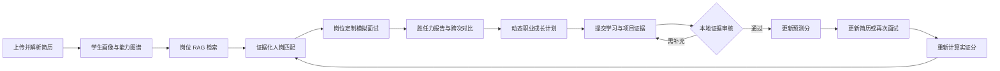

# 孔明职配（KongMing Job Matching Agent）

面向高校学生的人才培养与求职就业智能应用。系统以智能体为核心，把简历理解、职业能力评估、岗位知识检索、模拟面试、长期记忆和职业成长规划串联成一条可持续迭代的求职闭环。

> 当前版本重点解决三个问题：岗位匹配分必须有简历证据；面试结论必须经过多轮、分维度考察；成长任务完成后必须经过证据审核和重新测评，不能通过简单勾选直接“涨分”。

## 核心能力

| 模块 | 当前能力 |
| --- | --- |
| 简历编辑 | 上传 PDF 或图片简历，查看原始文档并编辑基础信息、教育、项目、竞赛、证书和语言能力等结构化字段；编辑字段时联动高亮原文位置。 |
| 简历解析 | 优先读取 PDF 文字层，质量不足时回退到 RapidOCR 或视觉模型；生成学生画像和六维简历完整度分析，实习与项目经历按 STAR 要素评估。 |
| 岗位知识库 | 基于 500 条带官方来源链接的岗位数据，使用 LlamaIndex、Qdrant、BM25 和可选 CrossEncoder 重排进行混合检索。 |
| 岗位匹配 | 从能力、经历、关键词、意向和成长潜力五个维度评分；每个维度、能力节点和总分均提供岗位依据与简历证据。 |
| 模拟面试 | 为 AI 算法、前端、后端、产品和全栈五类岗位建立六维胜任力模型；结合岗位 RAG、简历和历史记忆进行多轮追问、能力边界识别、一致性核验和证据化报告生成。 |
| 跨次成长对比 | 优先对齐同岗位、同面试类型的历史报告，比较共同复测维度、覆盖率和置信度；明确区分证据提升、稳定、下降、新增基线与未复测。 |
| 成长规划 | 根据用户目标日期动态生成阶段目标与每周任务，并推荐菜鸟教程、哔哩哔哩、Datawhale 等学习资源。 |
| 证据闭环 | 对任务证据的相关性、完整性和可信度进行本地审核；审核通过只更新预测分，重新分析简历或完成新面试后才更新实证分。 |
| AI 助手与记忆 | 保存用户偏好、多轮会话和回答反馈，支持跨会话恢复；后续回答会参考已保存的长期记忆。 |
| 账号与持久化 | 支持本地注册、登录、恢复码和 HttpOnly 会话；密码使用 scrypt 加盐哈希，成长方案和智能体记忆按账号隔离保存。 |

## 使用闭环



任务证据不能直接替代真实能力测评：

- `实证分`来自当前简历、目标岗位和面试结果，是最近一次正式测评结果。
- `预测分`基于已经通过审核的成长任务，用于展示潜在提升空间。
- 新成果写入简历或完成新一轮面试后，系统会记录新的实证分、证据覆盖率和前后变化，并据此调整下一阶段计划。

## 技术架构

```text
React 19 + TypeScript + Vite
├─ 简历处理：PDF.js + RapidOCR + 视觉模型回退
├─ 智能体服务：OpenAI 兼容 Chat Completions 代理
├─ 岗位 RAG：LlamaIndex + Qdrant Local + BM25 + CrossEncoder
├─ 匹配引擎：可解释五维评分 + 职业能力图谱 + 证据引用
├─ 面试引擎：五类六维胜任力模型 + 追问控制 + 会话门槛 + 一致性核验
├─ 面试报告：证据链评分 + RAG/长期记忆引用 + 跨次成长对比
├─ 成长引擎：动态阶段 + 证据审核 + 预测/实证分离 + 自动调整
└─ 持久化：Node.js SQLite + HttpOnly Cookie + 账号级数据隔离
```

本地开发时，Vite 同时提供前端页面和 `/api/ark`、`/api/ocr`、`/api/jobs/search`、`/api/memory` 四组同源接口，因此只需启动一个开发进程。生产环境可使用 `api/` 下的 Serverless 函数，并把岗位 RAG 独立部署成容器服务。

## 项目结构

```text
.
├─ api/                    # 生产环境 Serverless API
├─ deploy/job-rag/         # 岗位 RAG 容器、启动与数据打包脚本
├─ docs/                   # 架构、OCR、模块化和 RAG 设计文档
├─ scripts/                # 环境安装、索引构建及自动化验证
├─ server/                 # 模型、OCR、RAG、账号与记忆服务核心
├─ src/features/           # assistant、growth、identity、interview、jobs、matching、resume
├─ src/pages/              # 页面级组件
├─ vite.config.ts          # 本地同源后端中间件
└─ render.yaml             # 可选的线上 RAG 服务声明
```

## 快速开始

### 1. 环境要求

- Windows 10/11 或兼容的 Node.js 开发环境
- Node.js `>= 22.5.0`
- npm
- Miniconda/Anaconda（仅本地 OCR 和本地岗位 RAG 需要）
- Docker（仅构建线上 RAG 容器时需要）

### 2. 获取代码并安装依赖

```powershell
git clone https://github.com/lljjcc426/Kongming-Student-Job-Matching-Agent.git
Set-Location Kongming-Student-Job-Matching-Agent
npm ci
Copy-Item .env.example .env.local
```

### 3. 配置模型接口

服务端通过 OpenAI 兼容的 `/chat/completions` 接口调用文本和视觉模型。`.env.local` 至少需要配置：

```text
ARK_BASE_URL=https://ai.gitee.com/v1
ARK_API_KEY=请填写自己的访问令牌
ARK_MODEL=Qwen3-4B
ARK_VISION_MODEL=Qwen3-VL-8B-Instruct
```

使用 Gitee AI 资源包时可继续配置 `ARK_PACKAGE`；接入其他 OpenAI 兼容服务时，替换 `ARK_BASE_URL`、模型名称和令牌即可，不需要提交或修改业务代码。

请勿把真实 API Key 写入 `.env.example`、README、提交记录或前端 `VITE_*` 变量。模型令牌只应保存在未提交的 `.env.local` 或部署平台 Secret 中。

### 4. 启动前后端

```powershell
npm run dev
```

浏览器打开终端显示的地址，默认通常为 [http://localhost:5173](http://localhost:5173)。本地前端、模型代理、账号记忆接口会同时启动。

系统包含只用于演示的账号：

```text
昵称：demo
密码：123456
```

普通用户注册密码必须为 8–128 个字符，且不能使用常见弱密码。演示账号不应用于生产环境。

## 可选的本地能力

### OCR

有文字层的 PDF 默认由 PDF.js 解析；扫描件和图片可使用 RapidOCR。首次安装会在 D 盘创建独立 Conda 环境：

```powershell
npm run setup:ocr
```

默认路径为 `D:\conda_envs\kongming-ocr`。详细识别和坐标高亮链路见 [简历 OCR 坐标识别](docs/12-ocr-integration.md)。

### 岗位 RAG

首次使用本地岗位知识库时执行：

```powershell
npm run setup:rag
npm run build:job-index
```

如需启用二阶段重排：

```powershell
npm run setup:job-reranker
npm run verify:job-rerank
```

默认数据、索引和模型均保存到 D 盘：

```text
D:\Kongming-RAG\jobs-v1
D:\ai_models\kongming-rerankers\bge-reranker-v2-m3
```

完整的数据结构、混合召回、重排与远程服务说明见 [岗位 RAG 知识库](docs/14-job-rag-knowledge-base.md)。

### 账号与智能体记忆

SQLite 数据库默认保存在：

```text
D:\Kongming-Memory\agent-memory.sqlite3
```

可在 `.env.local` 中通过 `AGENT_MEMORY_DATA_ROOT` 和 `AGENT_MEMORY_DB_PATH` 修改。删除或迁移数据库前应先停止开发服务并做好备份。

## 岗位胜任力面试

### 五类岗位模型

系统目前覆盖以下方向，每个方向均包含 6 个权重合计为 100% 的胜任力维度，并为每个维度定义 L1、L3、L5 行为锚点、正向信号、风险信号和分层问题：

- AI 算法工程师
- 前端开发工程师
- 后端开发工程师
- 产品经理
- 全栈开发工程师

综合面、技术面和 HR 面采用不同的考察范围、有效回答门槛、目标轮次和最长轮次。追问控制器会根据上一轮证据选择澄清、深挖、压力验证或切换维度，不由大模型自由决定评分。

### 报告可信度约束

- 未考察维度显示为“未考察”，不等同于能力不足，也不参与能力认证。
- 过短、空泛或只有技术名词的回答会触发严格的综合分上限。
- 只有达到有效回答数、有效维度数和一致性门槛后才能生成正式报告；提前结束只能生成阶段性诊断。
- 回答一致性模块只识别需要进一步核验的信号，并以中性问题追问，不直接判断候选人是否诚实。
- 岗位 RAG 用于提供岗位职责和能力标准，历史记忆用于确定复测方向；两者都不能替代本轮回答证据直接加分。

### 跨次成长对比

面试结束后，系统会把报告类型、六维得分、维度置信度、证据数量、覆盖率和一致性结果写入账号级 SQLite 记忆。下一次面试优先选择“同岗位 + 同面试类型”的最近记录作为基线；没有同岗位记录时，才使用同胜任力方向的历史面试作为低一级参考。

为避免制造虚假成长结论，当前比较规则为：

- 新考察维度只标记为“新增基线”，不计为能力提升。
- 单维度两次置信度均不低于 30%，且分差达到 6 分，才判断证据提升或下降。
- 只有报告类型一致、覆盖率差距不超过 25 个百分点、两次整体置信度均不低于 35%，才比较综合分。
- 历史已考察但本次未覆盖的维度标记为“未复测”，不判断保持或退步。
- 升级前缺少六维快照的旧面试记录不会参与维度趋势计算；升级后的第一场面试将建立新基线。

跨次结果会显示在面试报告页面，并随 Markdown 报告一同下载。

## 构建与验证

生产构建：

```powershell
npm run build
```

关键回归测试：

```powershell
npm run verify:provider
npm run verify:resume-processing
npm run verify:match-evidence
npm run verify:interview-scoring
npm run verify:interview-competency
npm run verify:interview-session
npm run verify:interview-integrity
npm run verify:interview-growth
npm run verify:growth-loop
npm run verify:agent-memory
npm run verify:ui:standalone
```

面试测试分别覆盖五类胜任力模型、追问策略、正式报告门槛、一致性核验、同岗复测、新增基线和不可比较场景。`verify:growth-loop` 会验证弱证据不会涨分、预测分与实证分保持分离、75% 阶段解锁、正式复测记录以及旧计划迁移；`verify:ui:standalone` 会启动隔离测试服务并覆盖从简历上传、岗位匹配、面试报告、跨次对比到成长方案持久化的完整用户流程。测试数据库、运行时缓存和截图均写入 D 盘临时目录。

## 部署

- 前端与轻量 API 可部署到 Vercel。
- 岗位 RAG 不在 Serverless 函数中加载 Python、Qdrant 或重排模型，应独立运行单实例容器。
- 本地和线上模式通过 `JOB_RAG_BACKEND=auto|local|remote` 切换。
- 远程 RAG 使用 HTTPS 与 Bearer Token；服务令牌必须由部署平台 Secret 注入。

容器构建、数据校验、健康检查和远程网关配置见 [岗位 RAG 独立服务](deploy/job-rag/README.md)。线上部署是可选补强项，不影响当前版本在本地完成比赛演示。

## 文档索引

- [项目任务书](docs/00-project-charter.md)
- [技术方案与工具准备](docs/02-tech-stack-and-tools.md)
- [Git 协作规范](docs/03-git-workflow.md)
- [产品结构与界面规范](docs/07-product-structure-and-figma-spec.md)
- [多智能体与多模态架构](docs/08-multi-agent-multimodal-architecture.md)
- [职业运营融合方案](docs/09-career-ops-fusion.md)
- [简历 OCR 坐标识别](docs/12-ocr-integration.md)
- [前端模块化拆分](docs/13-frontend-modularization.md)
- [岗位 RAG 知识库](docs/14-job-rag-knowledge-base.md)

## 数据与安全说明

- 岗位条目保留 `source_url`、采集/校验时间和内容哈希，便于追溯官方来源；岗位信息可能随时间变化，投递前应以企业招聘官网为准。
- 简历、账号、对话和成长记录包含个人信息，不应提交到代码仓库或公开日志。
- 本地证据审核用于检查用户提交内容的结构与相关性，链接目前只做格式和来源域名检查，不代表系统已经远程核实作品真实性。
- 所有匹配分和成长预测均为求职辅助信息，不构成录用承诺或招聘决策。

## License

本项目使用 [Apache License 2.0](LICENSE)。
