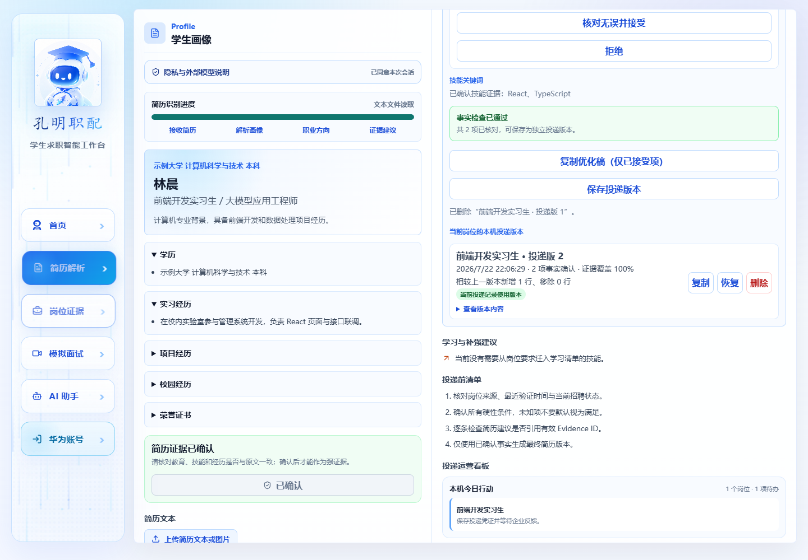
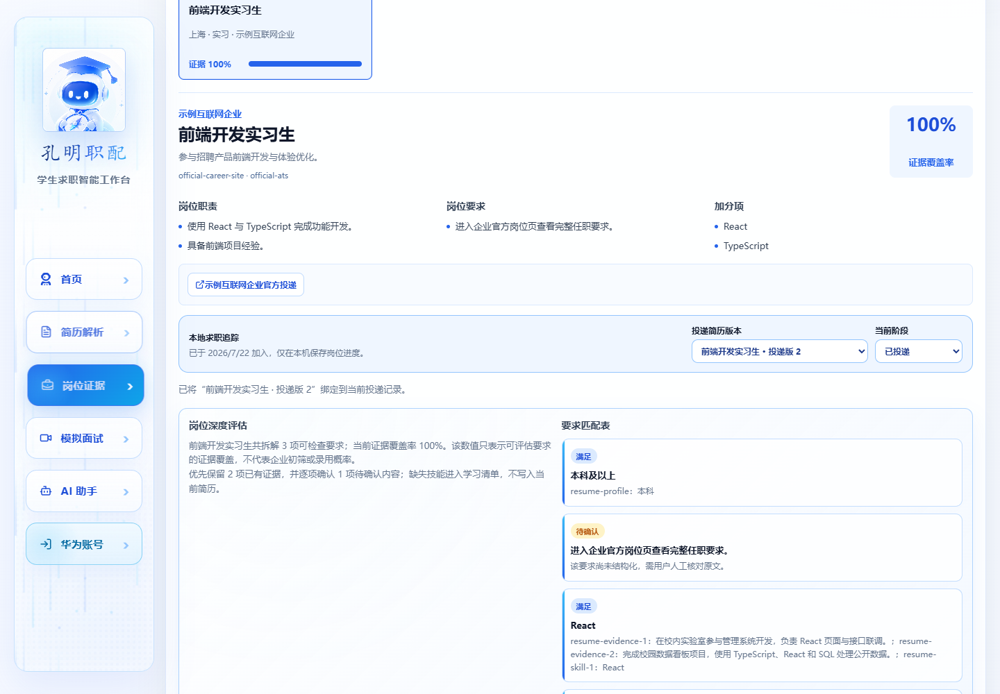
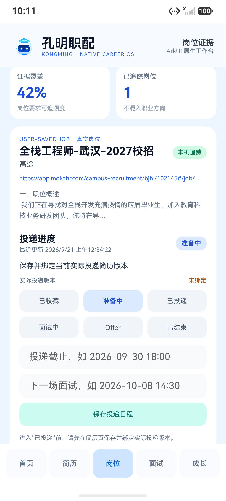
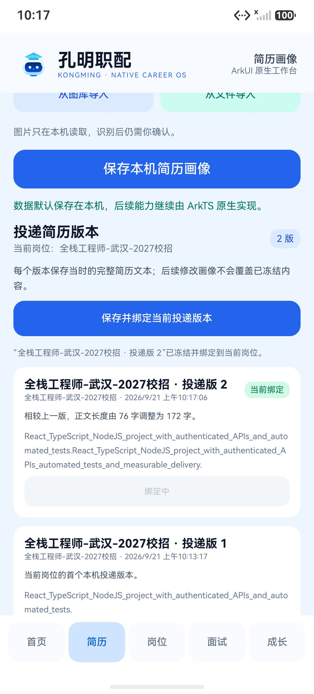
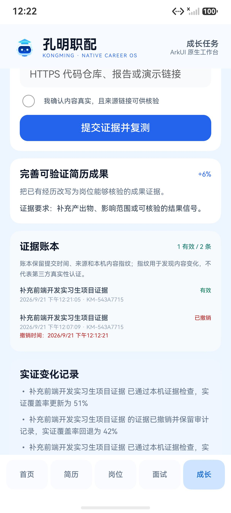
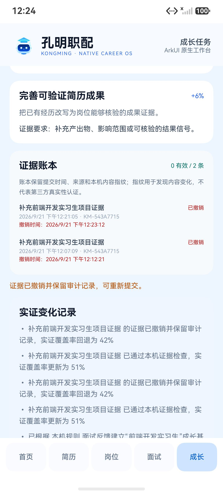
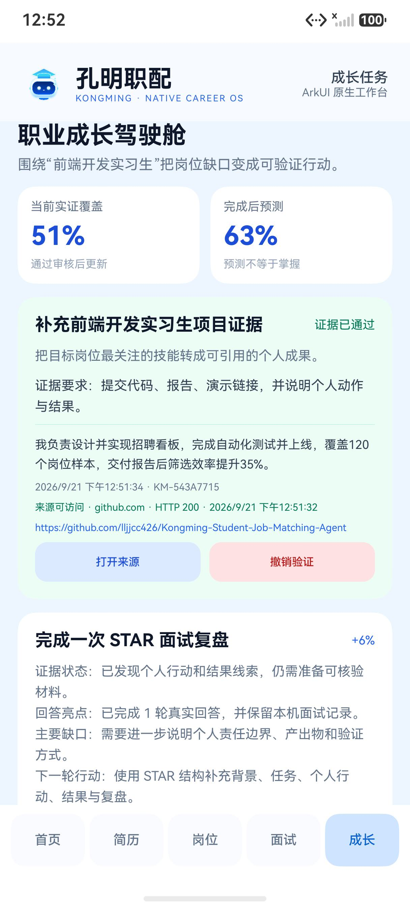

# 孔明职配

面向高校学生的求职证据工作台。项目聚焦互联网与数字技术岗位，把简历原文、岗位要求、事实确认、定制简历版本和投递进度组织成可追溯的求职闭环。

HarmonyOS 端已切换为 ArkUI/ArkTS 原生应用。当前主工作台由 `harmony/entry/src/main/ets/pages/NativeIndex.ets` 原生渲染，使用 ArkData Preferences 保存简历画像、岗位证据、投递阶段与时间线、面试和成长任务；五个主页面已统一语义色、紧凑卡片、系统 Symbol 导航和用户语言，原有 React/Web 代码仅作为 Web 产品与迁移参考保留，不再作为 HarmonyOS 主界面打包入口。架构边界和迁移策略见 [HarmonyOS 原生 UI 映射](docs/HARMONYOS_ORIGINAL_UI_MAPPING.md)。

> 当前可交付状态：ArkUI/ArkTS 原生主工作台已使用 D 盘 DevEco Studio 6.1.1.290 完成 ArkTS 编译、unsigned HAP 打包和 API 24 模拟器安装。岗位推荐 2.0 已支持求职偏好、薪资与时效信息、重复岗位清理、偏好冲突解释和反馈学习，所有偏好及反馈只保存在本机；原生投递阶段、日程、简历版本绑定门禁、时间线和杀进程恢复已通过模拟器验证，并已接入 Calendar Kit 系统事件编辑器。Form Kit 动态服务卡片会同步成长证据完成度和实证覆盖，并对摘要、路由和 Form ID 做边界清洗；卡片后台任务和同步失败已与主工作区保存结果隔离。模拟器已完成桌面添加、应用内刷新、覆盖安装保留、进程终止后存续，以及真实点击冷启动并精准进入成长页。岗位驱动模拟面试会绑定 JD 与简历版本，提取核验重点并推荐面试类型、难度和时长；横屏会话、岗位化首题、结构化反馈、STAR 改写示例和上下文快照已通过 API 24 模拟器验证。原生 AI 面试通过 Network Kit 统一业务网关接入讯飞星火 `4.0Ultra`，外部模型仅在会话授权后参与。成长任务已支持公开 HTTPS 来源 HEAD 优先、流式 Range GET 降级核验、用户真实性确认、本机内容指纹、撤销审计和重启恢复。当前仍未完成真机验收、生产 HTTPS 服务和正式签名。


## 核心价值

- 区分企业官方岗位、用户导入 JD 和 AI 职业方向，三类数据不混排。
- 先判断学历、地点等硬性条件，再把每项岗位要求映射到简历原文 Evidence ID。
- 证据覆盖率只表示“可评估要求中有原文证据的比例”，不是录用率、通过率或能力分。
- 缺失技能只进入学习与补强计划，不自动写进简历。
- 修改建议保留原文、证据 ID、对应岗位要求和风险，并要求用户逐条接受。
- 投递稿在导出和保存前再次执行事实检查；占位符、无证据项和失效证据会被拦截。
- 每个投递版本记录名称、目标岗位、创建时间、差异摘要、事实确认项和原文指纹，可复制、恢复和删除。
- 投递记录绑定实际使用的简历版本；没有绑定版本时不能进入“已投递”。
- 简历、岗位缓存、修改记录、版本和投递进度默认保存在当前设备，可一键清除。

## 当前功能

| 模块 | 当前实现 |
| --- | --- |
| 简历输入 | 文本、PDF、图片；PDF 优先读取文本层，图片优先调用本机 OCR，必要时才在用户同意后使用外部模型。 |
| 简历结构化 | 提取教育、实习、项目、校园经历、技能和求职方向；结构化结果需用户确认。 |
| 真实岗位 | 聚合企业公开招聘入口和 ATS 适配器，保留来源 URL、更新时间、最近发现时间和验证状态。 |
| 岗位推荐 2.0 | 在本机结合简历证据、期望城市、求职阶段、毕业年份、薪资、行业、目标企业、岗位时效和历史反馈排序；展示推荐依据与偏好冲突，支持“更感兴趣、地点不合适、要求偏高、不感兴趣”反馈和撤销。 |
| 证据匹配 | 硬性条件、满足/部分满足/无证据/待确认、Evidence ID、证据覆盖和风险等级。 |
| 事实约束改写 | 原文与建议并排、逐项接受/拒绝/编辑、导出前校验、缺失技能学习清单。 |
| 简历版本 | 本机保存、差异摘要、内容预览、恢复、删除、投递记录绑定。 |
| 求职追踪 | Web 端保留完整八阶段与简历版本绑定；HarmonyOS 原生端提供收藏、准备、已投递、面试、Offer、结束六阶段，并以 5 项离散清单核对真实 JD、简历画像、冻结版本、岗位面试和关键日程。日程可交给 Calendar Kit 系统编辑器确认；未绑定当前岗位冻结版本时不能进入已投递、面试或 Offer。 |
| 模拟面试 | 从岗位详情可直接保存并开始面试，绑定 JD 快照与简历版本，提取岗位核验重点并推荐类型、难度和时长；ArkUI 原生横屏数字人会话支持候选人相机、文本/语音回答、问题播报、岗位化追问、结构化证据反馈和 STAR 改写示例。外部模型仅在本次会话授权后经统一业务网关参与，失败时明确回退本机规则。 |
| 职业成长闭环 | 将岗位缺口和面试诊断转成成长任务；Network Kit 先校验域名解析结果均为公网地址，再以 HEAD 优先、流式 Range GET 降级方式核验最终 HTTPS 来源，自动重定向被拒绝；账本保存摘要、主机、核验方式、HTTP 状态、核验时间、内容指纹和有效/已撤销状态，实证覆盖随验证和撤销即时更新，并支持杀进程恢复。 |
| AI 助手 | 基于当前简历、岗位和匹配上下文进行多轮求职问答。 |
| 隐私 | 会话级外部模型授权、敏感字段脱敏、本机数据清除、服务不可用时本地降级。 |
| HarmonyOS | 华为账号、OCR、系统分享、TTS、语音识别、Calendar Kit 日历提醒、Form Kit 服务卡片和能力检测。 |

当前端到端回归中的版本管理与投递绑定：





当前 HarmonyOS 原生版本门禁与绑定：





当前 HarmonyOS 原生成长证据账本与撤销审计：







## 可信性规则

系统不会输出综合能力分或录用概率。岗位排序只使用：

1. 硬性条件和投递建议等级；
2. 可追溯证据覆盖；
3. 来源是否为可验证的具体岗位。

首页演示卡也只展示“有证据、部分证据、待确认”等离散状态，不再生成随机百分比或能力雷达分。以下旧逻辑由自动化检查阻止重新进入源码和 HAP 静态资源：固定能力分、简历长度加分、城市偏好增加专业分、固定分数阈值决定投递建议等。

运行可信性测试：

```powershell
npm run verify:evidence
npm run verify:claims
```

`verify:evidence` 当前包含 20 组事实约束对抗样例，覆盖简历没有的技能、职责、量化结果、上线经历和无效 Evidence ID。

## 快速开始

要求：Node.js 20 或更新版本、npm。

```powershell
npm install
npm run dev
```

默认访问：`http://localhost:5173`。

Web 生产构建：

```powershell
npm run build
```

核心验证：

```powershell
npm run verify:core
```

UI 验证需要先保持 `npm run dev -- --port 5173 --strictPort` 运行，然后在另一个终端执行：

```powershell
npm run verify:ui
```

UI 脚本会验证隐私门禁、岗位分层、事实确认、版本保存、投递绑定以及刷新后的数据恢复，并将脱敏截图写入忽略提交的 `artifacts/`。

成长闭环定向验证：

```powershell
npm run verify:growth
npm run verify:growth:ui
```

前者验证成长引擎的计划、证据审核和覆盖率边界；后者在浏览器中完成一次面试、两次证据提交和刷新恢复。比赛交付映射见 [成长闭环交付说明](docs/competition/05_GROWTH_LOOP_DELIVERY.md)。

## HarmonyOS 构建与运行

工程要求：DevEco Studio 6.1.1、HarmonyOS SDK 6.1.1(24)。

不依赖本机接口的普通构建：

```powershell
npm run build:harmony
```

模拟器本地联调：

```powershell
npm run dev -- --port 5173 --strictPort
npm run build:harmony:local
npm run run:harmony:emulator
```

`build:harmony:local` 将 `http://10.0.2.2:5173/api/*` 写入调试 HAP，其中 `10.0.2.2` 是模拟器访问电脑宿主机的开发网关。模拟器脚本默认冷启动，以规避部分快照启动后 HDC Offline 的问题；正式 HAP 仍只接受 HTTPS API。

当前产物位置：

```text
harmony/entry/build/default/outputs/default/entry-default-unsigned.hap
```

详细环境、HAP 大小、SHA-256、安装输出、原生入口和 OCR 文件选择证据见 [2026-09-20 交付证据](docs/RELEASE_EVIDENCE_20260920.md)。更完整的构建说明见 [HarmonyOS 工程说明](harmony/README.md)。

## 联网服务配置

浏览器只调用同源 `/api/gateway`；HAP 正式构建只注入这一条可公开访问的 HTTPS 网关地址。供应商接口和凭证始终由服务端持有，完整边界见 [公共网关安全说明](docs/API_SECURITY.md)。

| 配置 | 用途 |
| --- | --- |
| `AI_MODEL_PROVIDER` | 模型供应商；讯飞星火使用 `iflytek-spark`，未设置时保持 Ark/Gitee AI 兼容行为。 |
| `IFLYTEK_SPARK_API_PASSWORD` | 星火 OpenAI 兼容接口的服务端 `APIPassword`；与 WebSocket 三元组二选一。 |
| `IFLYTEK_SPARK_APP_ID/API_KEY/API_SECRET` | 星火原生 WebSocket HMAC 鉴权三元组，必须完整配置且禁止进入前端或 HAP。 |
| `IFLYTEK_SPARK_BASE_URL` | 默认 `https://spark-api-open.xf-yun.com/v1`。 |
| `IFLYTEK_SPARK_WS_URL` | 可选 WebSocket 地址覆盖；默认根据模型自动选择官方端点。 |
| `IFLYTEK_SPARK_MODEL` | 星火文本模型，必须与账号实际开通能力一致。 |
| `ARK_API_KEY` | 兼容原 Ark/Gitee AI 服务的服务端密钥。 |
| `ARK_BASE_URL` | Ark/OpenAI 兼容模型服务地址。 |
| `ARK_MODEL` | 文本模型。 |
| `ARK_VISION_MODEL` | 图片/PDF 视觉兜底模型。 |
| `PUBLIC_APP_ORIGINS` | 可选的额外浏览器来源白名单；同源 Web 与无 `Origin` 的原生请求无需配置。 |
| `KONGMING_GATEWAY_URL` | HAP 构建阶段使用的唯一公共网关地址；推荐通过 `-PublicApiBaseUrl` 或 `-GatewayApiUrl` 注入。 |
| `JOB_STORE_PATH` | 可选的岗位 JSON 快照路径。 |
| `JOB_SOURCE_CONFIG_JSON` | 可选的额外 ATS 来源配置。 |

正式地址构建会拒绝非 HTTPS 地址：

```powershell
npm run build:harmony:release -- `
  -PublicApiBaseUrl https://your-domain.example
```

仓库不包含生产密钥、证书、Profile 或完整后端数据库。当前 `api/` 和 `server/` 可部署为轻量无服务器代理；正式运营仍需增加账号数据治理、监控、限流、关闭岗位对账和隐私合规流程。

## 数据与隐私边界

- 外部模型授权只在当前会话有效，应用重启后必须重新同意。
- 本机工作区保存简历文本、结构化结果、岗位缓存、求职偏好、岗位反馈、修改决定和投递版本；投递追踪单独保存岗位阶段和绑定的版本 ID。
- 服务卡片只同步岗位数量、投递阶段、待办数量、下一行动、岗位名称、成长任务计数、实证覆盖率和目标路由，不同步简历正文。
- 华为账号本机只保存登录提示和 OpenID 尾部提示，不保存密码或访问令牌。
- 模型密钥只允许保存在服务端环境变量中。
- “清除本地求职数据”会删除工作区和投递追踪，不影响华为账号系统登录态。

## HarmonyOS 能力状态

| 能力 | 源码/构建 | 模拟器运行 | 真机待验 |
| --- | --- | --- | --- |
| ArkUI 原生主工作台 | 已实现源码 | API 24 模拟器编译、安装、首页、岗位列表、详情、六阶段投递时间线、双版本管理、绑定门禁、重启恢复及 compact/medium/expanded 三档布局已验收 | 真实折叠屏、平板和 2in1 的自由窗口、键鼠与字体缩放 |
| Network Kit 官方岗位 | 已接入原生服务、列表和详情 | 本机 API、系统官方链接与失败降级已验收 | 公网 HTTPS、弱网与更多机型 |
| Network Kit 原生 AI 面试 | 单一 `/api/gateway` 公共入口已接入讯飞星火 Provider；同时支持 APIPassword HTTP 与 APPID/APIKey/APISecret WebSocket HMAC；客户端不接触供应商端点或凭证 | 两种鉴权请求和网关脱敏均已通过 Mock 验证；无真实授权环境已验证本机首题、明确降级、持久化和授权重置 | 使用已开通对应模型的真实凭证完成追问/反馈、弱网和真机语音联调 |
| 原生成长证据账本 | Network Kit 公开 HTTPS 可访问性核验、真实性确认、本机内容指纹、有效/已撤销记录和覆盖率回退已实现 | 已验证私网地址拦截、GitHub `HTTP 200`、`42% → 51% → 42%`、强制停止恢复和撤销记录保留 | 提交归属、内容真实性、可信时间戳和人工复核流程 |
| Form Kit | 动态卡片同步下一行动、成长任务完成度、实证覆盖率和目标路由，点击使用 `postCardAction`；摘要、路由和 Form ID 统一清洗，生命周期异步异常被显式收口 | API 24 模拟器已验证桌面添加、应用内刷新、覆盖安装保留、进程终止后存续，以及真实点击冷启动精准进入成长页；卡片同步失败不再覆盖主工作区保存结果 | 真机桌面、不同系统版本和多设备尺寸 |
| Calendar Kit | 已接入系统事件编辑器；截止提醒为提前 24 小时/60 分钟，面试提醒为提前 24 小时/30 分钟 | 模拟器已验证编辑器、预填内容和取消不保存 | 真机保存、设备不支持路径和系统版本差异 |
| 华为账号 | 已接入 | 未执行登录 | 包名、签名指纹和控制台授权 |
| Core Vision OCR | 已接入 | 未用真实图片触发 | 中文识别质量和取消流程 |
| Share Kit | 已接入 | 未触发系统面板 | 成功、取消和异常回调 |
| Core Speech | TTS/STT 已接入，浏览器能力可降级 | 当前模拟器未做麦克风质量验收 | 权限拒绝、中英混合、后台和超时 |
| 候选人视频 | Camera Kit 原生预览与 Media Kit video-only 录像已接入；私有目录保存、面试档案关联、ArkUI Video 回看和独立删除已实现 | API 24 模拟器已验证实时预览及编码失败时预览保留、明确提示和空文件清理 | 真机 MP4 生成、长时录像、归档播放和删除 |

## 仓库结构

```text
api/        无服务器 API 入口与健康检查
docs/       架构、部署、测试、证据和竞赛材料
harmony/    HarmonyOS Stage 工程、ArkUI 原生页面与系统能力
public/     图片、视频、PDF.js 和数字人资源
scripts/    构建、岗位、可信性、UI 和模拟器验证脚本
server/     模型代理与岗位采集服务
src/        React 业务、领域、存储、桥接和页面
```

`harmony/entry/src/main/resources/resfile/` 不属于默认原生 HAP；只有执行 `npm run build:harmony:web-compat` 时才生成兼容资源。

## 文档索引

- [2026-09-20 交付证据](docs/RELEASE_EVIDENCE_20260920.md)
- [HarmonyOS 工程说明](harmony/README.md)
- [测试计划与本轮报告](docs/competition/02_TEST_PLAN_AND_REPORT.md)
- [成长闭环交付说明](docs/competition/05_GROWTH_LOOP_DELIVERY.md)
- [已知限制](docs/competition/03_KNOWN_LIMITATIONS.md)
- [竞赛提交清单](docs/competition/04_SUBMISSION_CHECKLIST.md)
- [部署指南](docs/DEPLOYMENT_GUIDE.md)
- [证据材料索引](docs/EVIDENCE_INDEX.md)
- [架构与竞赛策略](docs/competition/01_ARCHITECTURE_AND_STRATEGY.md)
- [开源来源说明](docs/OPEN_SOURCE_ATTRIBUTION.md)
- [第三方依赖与素材 License](docs/THIRD_PARTY_LICENSES.md)

代码采用 Apache License 2.0；第三方依赖、模型、媒体、品牌和演示素材仍遵循各自许可与授权边界。
