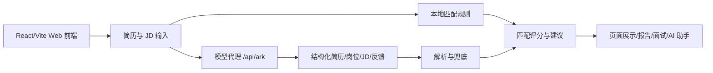

# 创意规划 PPT 内容骨架

本文用于承接“创意规划 PPT（阶段一）”材料，提供后续制作 PPT 的内容结构。本文以项目规划和展示为主，不记录 commit 历史。

## 1. 项目名称

孔明职配：面向学生求职场景的 AI 岗位匹配与简历优化智能体

## 2. 项目背景

学生求职过程通常涉及简历准备、岗位筛选、JD 理解、投递材料优化和面试准备。传统工具往往只覆盖其中一个环节，例如简历模板、岗位搜索或面试题库，难以形成连续闭环。

孔明职配希望将学生简历、岗位 JD 和面试准备统一到一个智能体工作台中，让学生能够快速判断“适合投什么、差在哪里、简历怎么改、面试怎么准备”。

## 3. 痛点分析

| 痛点 | 表现 | 影响 |
| --- | --- | --- |
| 岗位信息过载 | 学生面对大量岗位难以筛选 | 投递效率低，容易错过合适岗位 |
| 简历与 JD 脱节 | 简历经历没有对应岗位关键词和证据 | 初筛命中率不稳定 |
| 建议不可执行 | 简历优化建议泛泛而谈 | 学生不知道具体改哪一段 |
| 面试准备割裂 | 面试练习和目标岗位、简历经历没有关联 | 回答缺少岗位针对性 |
| 缺少解释 | 只给分数或结论，不说明依据 | 用户难以信任和复盘 |

## 4. 目标用户

- 在校大学生。
- 应届毕业生。
- 寻找实习机会的学生。
- 希望转向新岗位方向的低年级或跨专业学生。
- 就业指导老师和职业发展顾问可作为辅助使用者。

## 5. 解决方案

孔明职配设计为一个 Web 智能体工作台，围绕学生求职上下文组织功能：

1. 导入简历。
2. 生成学生画像。
3. 推荐适合岗位。
4. 分析目标 JD。
5. 输出匹配理由和差距。
6. 生成简历优化建议。
7. 进行模拟面试。
8. 通过 AI 助手持续问答。

## 6. 核心功能

| 功能 | 说明 |
| --- | --- |
| 简历解析 | 支持文本、PDF、图片简历输入，生成结构化学生画像。 |
| 岗位推荐 | 根据简历和求职意向生成候选岗位方向。 |
| 匹配评分 | 从能力、经历、关键词、兴趣和成长潜力进行可解释评分。 |
| JD 分析 | 对用户输入的目标岗位 JD 进行二次分析。 |
| 简历优化 | 生成个人总结、项目经历改写和技能关键词建议。 |
| 模拟面试 | 支持综合面、技术面、HR 面，并结合岗位和简历追问。 |
| AI 求职助手 | 支持多轮求职问答，带入当前简历和岗位上下文。 |
| 报告导出 | 生成 Markdown 分析报告，便于复盘和提交材料。 |

## 7. 技术路线

技术组成：

- 前端：React、TypeScript、Vite。
- 文件解析：PDF.js、图片压缩、视觉识别任务。
- 智能体：轻量 AgentContext、AgentNode、AgentArtifact 结构。
- 模型代理：服务端统一调用模型接口。
- 展示：Markdown、图表、Live2D/PNG 面试官、语音识别和语音合成。

## 8. 创新点

1. **学生场景聚焦**：重点处理课程项目、校园经历、竞赛、实习和求职意向，而不是通用简历打分。
2. **多智能体分工**：将简历理解、岗位发现、匹配推理、模拟面试和监督汇总拆成不同职责。
3. **多模态输入**：支持文本、PDF、图片和语音面试回答。
4. **可解释匹配**：不仅给总分，还展示关键词覆盖、风险、证据和行动建议。
5. **求职闭环**：从岗位推荐延伸到 JD 分析、简历优化、报告导出和模拟面试。
6. **安全代理设计**：模型密钥只在服务端读取，前端不直接暴露。

## 9. 应用场景

- 学生投递实习前进行岗位筛选。
- 应届生根据目标 JD 调整简历表达。
- 就业指导课中进行简历诊断演示。
- 学生进行面试前的结构化练习。
- 求职顾问辅助学生制定投递策略。

## 10. 阶段成果

当前项目已形成 Web Demo 的主要功能链路：

- 简历导入与结构化。
- 岗位推荐与匹配分析。
- 自定义 JD 分析。
- 简历优化建议。
- Markdown 报告导出。
- AI 数字人模拟面试。
- AI 求职助手。

需要提交前补充的材料：

- 正式 Demo 视频。
- 运行截图。
- 真实性能测试结果。
- 真实模型调用脱敏日志。
- GitLink Issue 开发记录。

## 11. 后续规划

- 接入目标国产算力平台模型服务，并补充真实调用证据。
- 增强模型 Provider 抽象，支持多模型切换。
- 增加真实岗位数据源或岗位库导入。
- 增加日志审计和性能统计。
- 增加用户反馈收集和投递状态追踪。
- 增加更多评测样例，验证简历解析和岗位推荐质量。

## 12. PPT 页结构建议

| 页码 | 标题 | 内容建议 |
| --- | --- | --- |
| 1 | 项目封面 | 项目名称、定位、团队信息 |
| 2 | 背景与痛点 | 学生求职中的信息过载、简历-JD 脱节、面试准备割裂 |
| 3 | 目标用户 | 学生、应届生、实习求职者、就业指导老师 |
| 4 | 解决方案概览 | 从简历到岗位推荐、JD 分析、简历优化、模拟面试的闭环 |
| 5 | 产品流程 | 用户上传简历到输出报告的流程图 |
| 6 | 核心功能 | 简历解析、岗位推荐、匹配评分、JD 分析、模拟面试、AI 助手 |
| 7 | 智能体架构 | Resume Intake、Job Discovery、Match Reasoning、Interview Coach、Supervisor |
| 8 | 技术路线 | React/Vite、模型代理、PDF.js、本地匹配规则、语音和数字人 |
| 9 | 创新点 | 学生场景、多模态、可解释、求职闭环、安全代理 |
| 10 | Demo 展示 | 插入运行截图和演示视频二维码 |
| 11 | 部署与验证 | 公网 Demo、模型调用、日志、性能测试 |
| 12 | 后续规划 | 国产算力接入、真实岗位源、日志审计、评测集和运营反馈 |

## 13. PPT 制作提醒

- 不要写无法证明的性能数字。
- 不要放未脱敏的真实简历。
- 不要出现真实 API Key 或部署平台 token。
- 未完成的能力应写成“后续规划”。
- 演示截图应优先展示核心闭环，而不是只展示视觉动效。
