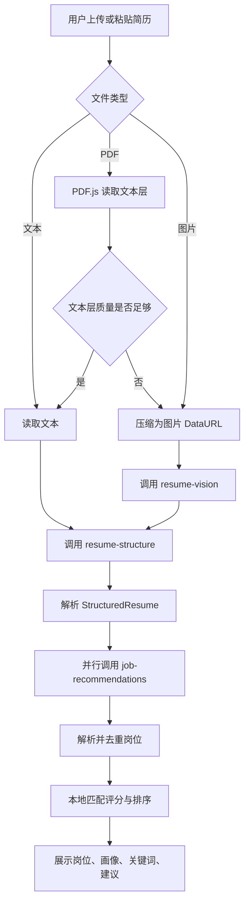
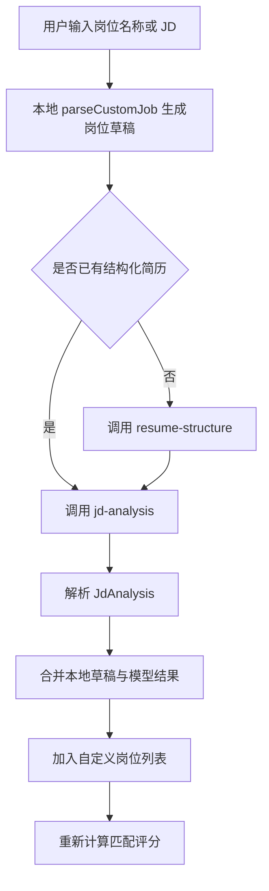
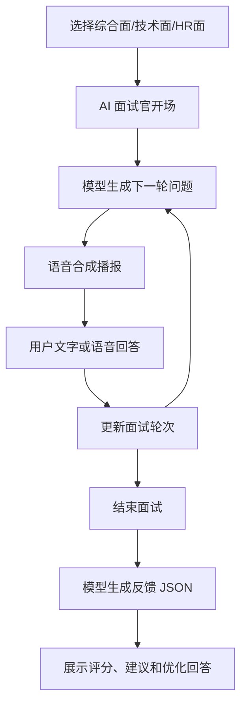

# 项目架构与理解文档

本文用于帮助后续维护者和开发者快速理解 Kongming Student Job Matching Agent 的真实代码结构、运行链路和可扩展边界。

## 1. 项目简介

孔明职配是面向学生求职场景的 AI 岗位匹配与简历优化智能体 Demo。项目聚焦学生在求职时常见的三个问题：

- 简历信息难以快速转化为结构化学生画像。
- 岗位 JD 与个人经历之间缺少可解释匹配。
- 简历优化、投递准备和模拟面试经常割裂。

当前项目输入包括：

- 文本简历、文本文件、PDF 简历、图片简历。
- 自定义岗位名称和岗位 JD。
- 模拟面试文字或语音回答。
- AI 助手多轮对话问题。

当前项目输出包括：

- 学生画像和简历结构化信息。
- 岗位推荐列表和岗位结构化信息。
- 匹配评分、关键词覆盖、优势、风险和行动建议。
- 简历优化草稿和 Markdown 分析报告。
- 模拟面试问题、语音交互和反馈报告。
- AI 求职助手多轮回复。

智能体在项目中的作用是将“简历理解、岗位发现、匹配推理、材料优化、面试准备、监督汇总”拆成不同职责模块，并围绕同一份求职上下文传递结构化产物。

## 2. 仓库结构说明

```text
.
├── README.md
├── LICENSE
├── NOTICE
├── api/
│   └── ark.js
├── docs/
├── public/
├── scripts/
├── server/
├── src/
├── index.html
├── package.json
├── tsconfig.json
├── vercel.json
└── vite.config.ts
```

| 路径 | 内容 | 运行链路关系 | 维护重点 |
| --- | --- | --- | --- |
| `api/` | Vercel Serverless API 入口 | 生产环境 `/api/ark` 请求入口 | `api/ark.js` 的请求方法、安全头、body 限制 |
| `server/` | 模型代理核心逻辑 | 本地 Vite 代理和 Vercel API 共同调用 | 任务校验、模型请求、搜索链接补充 |
| `src/` | 前端应用主代码 | 用户交互、状态流、智能体结果展示 | `App.tsx`、智能体、解析器、页面模块 |
| `src/components/` | 首页、加载页、面试页、AI 助手组件 | 展示层和交互控件 | 视觉表现、响应式和组件状态 |
| `src/pages/` | 首页、AI 助手、模拟面试页 | 路由式页面切换由 `App.tsx` 控制 | 页面入参和事件回调 |
| `src/modelProviders/` | 面试模型 Provider | 模拟面试调用模型代理 | fallback 问题、反馈 JSON 解析 |
| `src/speechToText/` | 浏览器语音识别适配 | 模拟面试语音回答 | Web Speech API 兼容和错误兜底 |
| `src/tts/` | 浏览器语音合成适配 | AI 面试官朗读问题和反馈 | SpeechSynthesis 兼容 |
| `public/avatars/` | 2D/Live2D 面试官素材 | 模拟面试数字人展示 | 模型路径、fallback 资源和素材授权说明 |
| `public/vendor/pdfjs/` | PDF.js CMap 资源 | PDF 文本层读取 | CMap 完整性和 License |
| `scripts/` | 验证脚本 | 解析器测试和 UI Mock 验证 | 运行前需要 dev server 或依赖环境 |
| `docs/` | 架构、技术、部署、证据、PPT 和合规文档 | 公开说明和维护说明 | 保持和真实实现一致 |

## 3. 核心模块说明

| 模块 | 路径 | 职责 | 输入 | 输出 | 调用关系 |
| --- | --- | --- | --- | --- | --- |
| 应用主流程 | `src/App.tsx` | 管理页面切换、简历上传、模型任务、岗位排序、报告导出和 AI 助手状态 | 用户上传文件、文本输入、JD、面试回答、聊天消息 | 页面状态、模型结果、报告文件 | 调用 `callArkAgent`、解析器、匹配引擎、报告生成 |
| 智能体运行时 | `src/agentRuntime.ts` | 定义 Agent、上下文、事件和产物协议 | Agent 输入、共享状态、Agent 列表 | 事件列表和产物列表 | 被 `src/agents.ts` 调用 |
| 智能体团队 | `src/agents.ts` | 实现简历解析、岗位发现、匹配推理、模拟面试、监督汇总等轻量智能体 | 学生画像、岗位、匹配结果、简历文本 | `AgentTeamResult` | 调用 `runWorkflow`，为展示和扩展提供结构 |
| 匹配引擎 | `src/matchEngine.ts` | 基于规则生成五维评分、优势、风险和行动建议 | `StudentProfile`、`Job`、简历文本 | `MatchResult` | 被 `App.tsx`、报告、运营评估调用 |
| 简历结构解析 | `src/modelParsers.ts` | 解析模型返回的简历 JSON、岗位 JSON、JD 分析 JSON，并提供宽松修复 | 模型文本结果 | `StructuredResume`、`Job[]`、`JdAnalysis` | 被 `App.tsx` 调用 |
| PDF 简历读取 | `src/pdfResumeReader.ts` | 使用 PDF.js 读取文本层，必要时渲染页面图片供视觉模型识别 | PDF 文件 | 文本、质量分、页数、图片 DataURL | 被 `App.tsx` 动态导入 |
| 模型客户端 | `src/arkClient.ts` | 前端统一请求模型代理，处理超时和错误 | `ArkRequest` | `ArkResponse` | 被主流程和面试 Provider 调用 |
| 模型代理核心 | `server/arkCore.js` | 校验任务、构建模型请求、调用 chat/completions、补充招聘搜索链接 | HTTP body、环境变量 | HTTP 状态和 JSON payload | 被 `api/ark.js` 和 `vite.config.ts` 调用 |
| Vercel API | `api/ark.js` | 生产环境 API 入口和安全头 | POST 请求 | JSON 响应 | 调用 `runArkCompletion` |
| Vite 本地代理 | `vite.config.ts` | 本地开发时挂载 `/api/ark` | 本地 POST 请求 | JSON 响应 | 调用 `runArkCompletion` |
| JD 规则解析 | `src/jobParser.ts` | 在模型 JD 分析前生成本地岗位草稿 | 岗位名称、JD 文本 | `Job` 草稿 | 被 `App.tsx` 调用 |
| 简历优化 | `src/resumeOptimizer.ts` | 生成个人总结、项目经历改写和技能关键词行 | 学生画像、岗位、匹配结果 | `OptimizedResumeDraft` | 被 `App.tsx` 和报告调用 |
| 报告生成 | `src/report.ts` | 生成 Markdown 分析报告并触发下载 | 学生画像、岗位、评分、简历、优化稿 | `.md` 文本文件 | 被 `App.tsx` 调用 |
| 求职运营评估 | `src/careerOps.ts` | 生成岗位深度评估、要求匹配表和投递运营看板 | 学生画像、岗位、评分 | `CareerOpsEvaluation` | 被 `App.tsx` 和报告调用 |
| 模拟面试页面 | `src/pages/InterviewPage.tsx` | 提供综合面、技术面、HR 面对话式模拟面试 | 岗位、画像、简历、用户回答 | 面试消息、反馈报告 | 调用面试 Provider、STT、TTS、数字人 |
| 面试模型 Provider | `src/modelProviders/interviewProvider.ts` | 生成面试追问和反馈，提供 fallback | 面试消息、轮次、岗位、面试类型 | 问题文本、反馈 JSON | 调用 `callArkAgent` |
| 语音识别 | `src/speechToText/browserSpeechRecognitionAdapter.ts` | 封装浏览器 SpeechRecognition | 麦克风输入 | 转写文本 | 被 `InterviewPage` 调用 |
| 语音合成 | `src/tts/browserSpeechSynthesisAdapter.ts` | 封装浏览器 SpeechSynthesis | 文本 | 播放状态 | 被 `InterviewPage` 调用 |
| Live2D 面试官 | `src/components/interview/Live2DInterviewerAvatar.tsx` | 加载 Live2D 模型，失败时回退 PNG | 状态 `idle/listening/thinking/speaking/error` | 数字人展示 | 被 `InterviewerAvatar` 调用 |

## 4. 总体运行流程

### 本地启动流程

1. 执行 `npm install` 安装依赖。
2. 执行 `npm run dev` 启动 Vite。
3. Vite 通过 `arkDevProxy` 挂载本地 `/api/ark`。
4. 浏览器访问页面，React 从 `src/main.tsx` 渲染 `App`。
5. 用户上传或粘贴简历后，前端进入解析和推荐流程。

### 简历到岗位推荐流程



### JD 分析流程



### 模拟面试流程



## 5. 智能体设计说明

当前项目没有引入 CrewAI、LangGraph 等外部重型 Agent 运行时，而是通过 TypeScript 类型和函数组织轻量智能体流程。

### 智能体目标

- 将学生求职流程拆解为多个职责明确的子任务。
- 让每个子任务输出结构化产物，便于页面展示和报告生成。
- 保留后续替换为外部 Agent 框架或工具调用的扩展空间。

### 当前智能体角色

| 智能体 | 输入 | 推理步骤 | 输出 |
| --- | --- | --- | --- |
| Resume Intake Agent | 学生画像、简历文本、匹配结果 | 汇总技能、经历标签、关键词覆盖和缺口 | 学生画像摘要、能力信号、缺口 |
| Job Discovery Agent | 学生画像、岗位、匹配结果 | 生成检索词、排序候选岗位、说明推荐原因 | 岗位搜索计划、候选岗位 |
| Match Reasoning Agent | 匹配结果 | 提炼投递结论、优势和行动 | 匹配推理结果 |
| Interview Coach Agent | 目标岗位、匹配风险 | 生成面试问题和考察重点 | 模拟面试计划 |
| Supervisor Agent | 所有智能体产物 | 汇总结论和交接关系 | 协作汇总结论 |

### 模型任务与输出格式

`server/arkCore.js` 为每类模型任务构建请求内容，要求若干任务返回严格 JSON：

- `resume-structure`
- `job-recommendations`
- `jd-analysis`
- `interview-feedback`

`modelParsers.ts` 和 `interviewProvider.ts` 对模型输出增加 JSON 提取、格式修复和字段级兜底，避免模型附加 Markdown 或尾随文本导致页面崩溃。

### 错误处理

- 前端请求使用 `AbortController` 超时。
- 服务端使用 `AbortSignal.timeout` 控制模型请求超时。
- 未配置 `ARK_API_KEY` 时，服务端返回 503 和明确错误信息。
- 图片简历、PDF 视觉识别和岗位推荐失败时，页面进入 error 状态并显示可理解提示。
- 模拟面试在模型不可用时提供 fallback 问题。

## 6. 模型接口调用说明

| 接口/模型 | 调用位置 | 配置项 | 输入 | 输出 | 是否需要密钥 | 备注 |
| --- | --- | --- | --- | --- | --- | --- |
| OpenAI 兼容 chat/completions | `server/arkCore.js` | `ARK_API_KEY`、`ARK_BASE_URL`、`ARK_MODEL`、`ARK_VISION_MODEL`、`ARK_PACKAGE`、`ARK_REQUEST_TIMEOUT_MS` | messages、model、temperature、max_tokens 或 max_completion_tokens | OpenAI 风格 choices | 是 | 默认保留 Ark/Doubao；Gitee AI / 沐曦环境使用 `Qwen3-4B` 与 `Qwen3-VL-8B-Instruct` |
| 前端模型代理 | `src/arkClient.ts` | `VITE_ARK_API_URL` | `ArkRequest` | `ArkResponse` | 否，前端不持有密钥 | 默认请求 `/api/ark` |
| Vercel API | `api/ark.js` | 部署平台环境变量 | POST JSON body | JSON payload | 服务端读取密钥 | 仅支持 POST |
| 本地 Vite API | `vite.config.ts` | 本地环境变量 | POST JSON body | JSON payload | 服务端读取密钥 | 开发环境代理 |
| Bing 公开搜索 | `server/arkCore.js` | 无 | 岗位标题、方向、关键词 | 招聘入口候选链接 | 否 | 仅用于补充公开招聘入口，失败时返回空列表 |

当前仓库已落地 Gitee AI / 沐曦 Token 资源包调用实现，并补充真实调用证据。`server/arkCore.js` 会根据 `ARK_BASE_URL` 自动选择 Gitee AI 兼容参数或原 Ark/Doubao 兼容参数。

## 7. 配置文件与环境变量说明

| 配置项 | 来源 | 是否必填 | 用途 | 示例 |
| --- | --- | --- | --- | --- |
| `ARK_API_KEY` | 环境变量 | 模型调用必填 | 服务端模型接口鉴权 | `your_model_api_key` |
| `ARK_BASE_URL` | 环境变量 | 否 | 覆盖默认模型接口地址 | `https://ark.cn-beijing.volces.com/api/v3` |
| `ARK_REQUEST_TIMEOUT_MS` | 环境变量 | 否 | 服务端模型请求超时 | `65000` |
| `VITE_ARK_API_URL` | 环境变量 | 否 | 前端模型代理 URL | `/api/ark` |
| `VITE_AVATAR_MODE` | 环境变量 | 否 | 数字人模式标记 | `static` |
| `MAX_DEV_BODY_BYTES` | `vite.config.ts` 常量 | 是 | 本地 API 请求体上限 | `8000000` |
| `MAX_UPLOAD_BYTES` | `src/App.tsx` 常量 | 是 | 前端上传文件上限 | `8000000` |
| `MAX_IMAGE_COUNT` | `server/arkCore.js` 常量 | 是 | 视觉识别图片页数上限 | `4` |

仓库当前提供 `.env.example` 占位模板。维护者可以根据 README 和部署指南创建 `.env.local`，但不要提交真实密钥。

## 8. 依赖清单说明

项目使用 Node.js 生态，依赖来源为 `package.json` 和 `package-lock.json`。

### 运行时依赖

| 依赖 | 用途 |
| --- | --- |
| `react`、`react-dom` | 前端应用渲染 |
| `vite`、`@vitejs/plugin-react` | 开发服务器、构建和 React 插件 |
| `pdfjs-dist` | PDF 简历文本层读取和页面渲染 |
| `react-markdown`、`remark-gfm` | 模型增强分析和报告类内容渲染 |
| `recharts` | 匹配评分图表 |
| `lucide-react`、Font Awesome | 页面图标 |
| `gsap`、`animejs` | 首页和加载页动效 |
| `three`、`@react-three/fiber`、`@react-three/drei` | AI 助手视觉效果 |
| `pixi.js`、`pixi-live2d-display`、`@hazart-pkg/live2d-core` | Live2D 面试官展示 |

### 开发和验证依赖

| 依赖 | 用途 |
| --- | --- |
| `typescript` | 类型检查和构建 |
| `playwright` | UI 自动化验证 |
| `@types/react`、`@types/react-dom` | React 类型定义 |

仓库当前没有 Python、Go、Java、Docker 或 CI 配置文件。

## 9. 示例输入输出

### 示例一：文本简历分析

前置条件：

- 本地或部署环境已启动。
- 若需要模型岗位推荐，服务端已配置 `ARK_API_KEY`。

输入内容：

```text
姓名：陈雨
华东师范大学 心理学 本科
求职意向：用户研究实习生 / 心理测评产品实习生
项目经历：完成大学生压力与睡眠质量调查项目，使用 SPSS 分析 286 份问卷。
技能：SPSS、问卷设计、访谈、数据分析。
```

处理流程：

1. 前端读取文本。
2. 调用 `resume-structure`。
3. 并行调用 `job-recommendations`。
4. 解析岗位结果并本地评分。

预期输出含义：

- 页面显示学生画像、推荐岗位卡片、匹配评分、关键词覆盖和简历优化建议。
- 如果模型未配置，页面会给出模型服务不可用的错误提示，不会暴露密钥。

### 示例二：自定义 JD 分析

前置条件：

- 页面已有简历文本或结构化画像。

输入内容：

```text
岗位名称：用户研究实习生
岗位 JD：负责用户访谈、问卷设计、需求洞察和调研报告输出，要求具备数据分析能力。
```

处理流程：

1. `parseCustomJob` 生成本地岗位草稿。
2. 如缺少结构化简历，则补充调用 `resume-structure`。
3. 调用 `jd-analysis`。
4. 合并模型结构和本地岗位草稿。
5. 重新计算匹配分和展示行动建议。

预期输出含义：

- 页面新增自定义岗位。
- 展示投递优先级、岗位关键词、优势、风险和行动建议。

## 10. 安全边界

| 类型 | 当前处理方式 |
| --- | --- |
| API Key | 只通过服务端环境变量读取，前端不直接持有。 |
| Token/Cookie | 仓库未发现需要提交的真实 token 或 cookie。 |
| 数据库连接串 | 当前项目未实现数据库连接。 |
| 本地配置文件 | `.gitignore` 排除 `.env` 和 `.env.*`，允许未来维护 `.env.example`。 |
| 用户简历信息 | 当前主要保存在浏览器状态和模型请求体中，未实现数据库持久化。 |
| 岗位数据 | 岗位由模型返回、自定义 JD 或本地草稿生成，公开搜索仅补充招聘入口候选链接。 |
| 日志脱敏 | 仓库当前未实现持久化日志，公开真实调用日志前需要人工脱敏。 |
| 外部写入 | 当前不做自动投递，也不登录招聘平台。 |
| 错误处理 | 使用请求校验、超时、错误提示和 fallback 问题，避免页面直接崩溃。 |

## 11. 后续扩展方向

以下内容属于设计规划和展望，不应写成已完成能力：

- 扩展更多 Gitee AI / 沐曦资源包可用模型，并补充更多真实调用日志。
- 继续完善模型 Provider 抽象，让 Ark、Gitee AI 和其他 OpenAI 兼容模型可配置切换。
- 增加持久化运行日志、延迟统计、成功率统计和脱敏导出。
- 增加真实岗位数据源或可导入岗位库。
- 增加评测集，衡量简历解析完整性、岗位推荐相关性和 JD 分析准确性。
- 增加 Dockerfile、CI、端到端测试报告和部署脚本。
- 增加演示视频、运行截图和公开查看路径。
- 强化隐私模式，例如本地处理、字段脱敏和日志采样。
