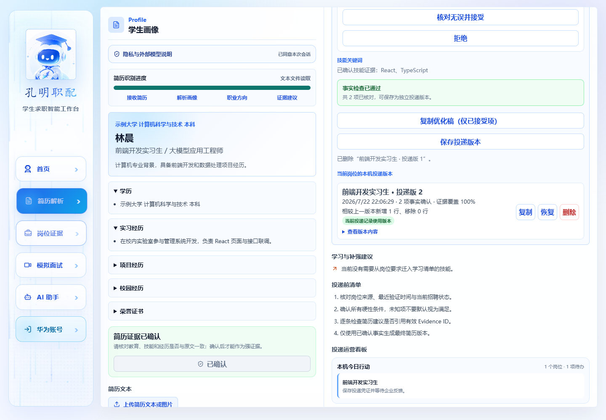

# 2026-07-22 构建、安装与运行证据

本文只记录本轮实际执行并取得输出的项目，不用“已有源码”替代“运行通过”。正式签名、真机 Kit 和公网服务没有在本轮完成，状态在文末单列。

## 1. 环境

| 项目 | 实测值 |
| --- | --- |
| 操作系统 | Windows 11 专业工作站版 10.0.22631，64 位 |
| 内存 | 16 GB |
| Node.js | v24.14.0 |
| npm | 11.9.0 |
| DevEco Studio | 6.1.1.290，build 243.24978.46.36.611290 |
| HarmonyOS SDK | 6.1.1(24) |
| Emulator | 6.1.1.300 |
| HDC | 3.2.0d |
| 模拟器实例 | `KongMing_API24` |
| 模拟器设备 | Pura 90 Pro，x86_64，4 核，4 GB RAM |
| 模拟器系统 | HarmonyOS 6.1.1(24)，software 6.1.0.125 |

## 2. 自动化结果

### Web 构建

命令：

```powershell
npm run build
```

结果：退出码 `0`；TypeScript 检查和 Vite 生产构建通过。Vite 报告部分按需包大于 500 kB，这是性能优化提醒，不影响本次构建有效性。

### 核心可信性

命令：

```powershell
npm run verify:evidence
```

结果：退出码 `0`。

```text
confirmedCoverage: 100
unconfirmedCoverage: 50
hardGate: pass
adversarialCases: 20
resumeVersionBound: true
```

上述百分比是固定测试夹具中“可评估要求是否有已确认证据”的覆盖，不是录用概率。

20 组对抗样例覆盖：简历不存在的 Java、Spring Boot、微服务、线上部署、主导/负责职责、量化结果、云平台、数据工具、论文、奖项和团队管理。自动生成的简历文本不得出现这些主张；它们只允许进入学习与补强计划。

### 旧评分退出检查

命令：

```powershell
npm run verify:claims
```

结果：退出码 `0`；扫描 `src/` 和 HAP 内同步的 Web 静态资源，共检查 67 个文件和 9 类禁止模式。未发现固定能力分、固定投递阈值、简历长度加分、“五维匹配”或“成长潜力”等旧逻辑。

### 浏览器完整闭环与冷启动恢复

命令：

```powershell
npm run dev -- --port 5173 --strictPort
npm run verify:ui
```

结果：退出码 `0`。该测试使用 Mock 岗位和 Mock 模型，不代表生产 API 已上线；它验证的是前端业务和存储闭环。

已验证：

- 未经同意上传本地文本时没有外部模型请求；
- 测试手机号和邮箱没有进入模型请求；
- 已验证岗位、导入 JD 和职业方向分层；
- 简历确认前后证据状态发生预期变化；
- 修改必须去除占位符并逐条接受；
- 连续保存两个独立投递版本并生成相对上一版的差异摘要；
- 恢复最新版本，删除未绑定旧版本；
- 投递记录绑定指定版本后才能进入“已投递”；
- 页面刷新后学生资料、剩余版本、投递阶段和版本绑定仍能恢复；
- 面试与 AI 助手按需页面可打开。

关键输出：

```text
savedResumeVersions: 2
remainingResumeVersions: 1
latestVersionSummary: 相较上一版本新增 1 行、移除 0 行
restoredResumeVersions: 1
restoredStudentName: 林晨
persistedApplicationStage: applied
persistedResumeVersionId: resume-...
sensitivePayloadLeak: false
modelRequestsBeforeConsent: 0
```




## 3. HAP 构建

本轮使用本机联调地址构建：

```powershell
npm run build:harmony:local
```

结果：

```text
Hvigor: BUILD SUCCESSFUL
Web resource files: 199
Web resource bytes: 33,373,762
HAP: harmony/entry/build/default/outputs/default/entry-default-unsigned.hap
HAP bytes: 34,324,777
SHA-256: 728B5635495DB019DC5C9D34E72CB4745584D4FBAA98F78500C8D6AE7C265A28
```

构建有两类已知警告：

- 账号、Core Speech、OCR、Share Kit 等系统能力并非所有设备都具备；运行时必须能力检测和降级。
- `signingConfigs` 为空，因此产物是 unsigned 调试 HAP。

这些警告不影响模拟器安装，但 unsigned HAP 不能作为应用市场发布包。

## 4. 模拟器安装与启动

### 调试通道恢复

第一次使用快照启动时，模拟器日志显示 Guest OS 已启动完成，但 HDC 目标保持 `Offline`，安装没有开始。执行冷启动后：

```text
127.0.0.1:15555  TCP  Connected  localhost  hdc
```

运行脚本已改为默认 `coldboot`，并在检测到运行中模拟器 HDC 离线时自动重启。

### 安装与首次启动

命令：

```powershell
npm run run:harmony:emulator
```

结果：

```text
install bundle successfully.
AppMod finish
start ability successfully.
Bundle: cn.kongming.jobmatch
Ability: EntryAbility
Target: 127.0.0.1:15555
```

### 二次启动

实际执行：

```powershell
hdc -t 127.0.0.1:15555 shell aa force-stop cn.kongming.jobmatch
hdc -t 127.0.0.1:15555 shell aa start -a EntryAbility -b cn.kongming.jobmatch
```

结果：

```text
force stop process successfully.
start ability successfully.
```

`bm dump` 同时确认：

- 包名 `cn.kongming.jobmatch`；
- 版本 `1.0.0`；
- `EntryAbility` 已注册；
- `ApplicationFormAbility` Form Extension 已注册；
- Camera、Internet、Microphone 权限声明存在；
- `appSignType` 为 `none`，符合 unsigned 调试产物状态。

### 截图


截图由模拟器 `snapshot_display` 直接采集，尺寸 1256 × 2760，文件大小 290,906 bytes。

## 5. 本轮没有宣称通过的项目

以下项目需要正式签名、账号控制台配置、支持相应系统能力的真机或公网服务，本轮只确认了源码与构建：

- 华为账号真实登录与退出；
- 真实图片 Core Vision 中文 OCR；
- Share Kit 系统面板的成功、取消和异常回调；
- Core Speech 麦克风授权、拒绝、中英混合、后台和网络异常；
- 桌面添加服务卡片、应用进程终止后的动态刷新和精准页面跳转；
- 手机、平板和 2in1 多设备布局；
- 注入公网 HTTPS 岗位与模型 API 后的 HAP 端到端联网链路；
- 正式签名与应用市场发布包。

## 6. 复核命令

```powershell
npm run verify:core
npm run build

# 另开终端保持服务运行
npm run dev -- --port 5173 --strictPort
npm run verify:ui

npm run build:harmony:local
npm run run:harmony:emulator

Get-FileHash -Algorithm SHA256 `
  harmony\entry\build\default\outputs\default\entry-default-unsigned.hap
```
