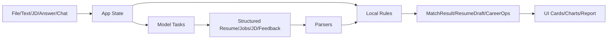

# 技术说明文档

本文从设计和架构角度说明孔明职配的技术方案。内容基于当前仓库真实实现，并区分已实现能力、已预留能力和后续规划。

## 1. 技术目标

孔明职配的技术目标是搭建一个可运行、可解释、可扩展的学生求职匹配智能体 Web Demo：

- 支持文本、PDF、图片等多种简历输入。
- 将简历内容转化为结构化学生画像。
- 根据学生画像生成岗位推荐并进行本地可解释评分。
- 结合自定义 JD 进行二次岗位分析。
- 提供简历优化、报告导出、模拟面试和 AI 求职问答。
- 使用后端代理统一封装模型调用，避免前端暴露密钥。
- 保持无数据库的轻量部署方式，便于公网演示和复现。

## 2. 需求分析

### 用户需求

- 学生希望快速理解自己的简历适合哪些岗位。
- 学生希望知道目标岗位和简历之间的差距。
- 学生希望获得可执行的简历优化建议，而不只是泛泛评分。
- 学生希望在投递前进行针对目标岗位的模拟面试练习。

### 系统需求

- 简历输入方式要兼容文本、PDF 和图片。
- 模型输出必须经过结构化解析和兜底，不能直接信任自由文本。
- 匹配评分要可解释，能够展示关键词、优势、风险和行动建议。
- 模型密钥不能进入前端。
- 页面需要在模型不可用时给出明确错误提示或降级结果。

## 3. 总体架构

```mermaid
flowchart TD
    A[React Web 前端] --> B[上传简历/JD/面试回答/聊天问题]
    B --> C[前端状态与解析协调层 App.tsx]
    C --> D[本地规则模块]
    C --> E[模型代理客户端 arkClient.ts]
    E --> F[/api/ark]
    F --> G[server/arkCore.js]
    G --> H[Ark 兼容 chat/completions]
    G --> I[公开招聘搜索补充链接]
    D --> J[匹配评分/简历优化/报告生成]
    H --> K[结构化模型输出]
    K --> L[modelParsers.ts 容错解析]
    L --> J
    J --> M[页面展示和 Markdown 报告]
```

### 前端层

前端由 React、TypeScript 和 Vite 构建。`src/App.tsx` 管理主要状态和页面切换，并将简历、岗位、模型状态、JD 分析、面试和 AI 助手串联为一个完整工作台。

### 智能体编排层

`src/agentRuntime.ts` 和 `src/agents.ts` 定义轻量智能体结构。当前实现不是外部 Agent 框架，而是用 TypeScript 类型和函数保持智能体职责清晰。

### 模型代理层

`src/arkClient.ts` 将前端模型请求统一发送到 `/api/ark`。本地开发时由 `vite.config.ts` 挂载代理，生产环境由 `api/ark.js` 处理请求，二者都调用 `server/arkCore.js`。

### 展示层

页面包括首页、简历/岗位工作台、模拟面试页和 AI 求职助手页。样式集中在 `src/styles.css`，部分复杂视觉组件位于 `src/components/`。

## 4. 智能体设计

### 已实现设计

| 智能体 | 职责 | 主要输入 | 主要输出 |
| --- | --- | --- | --- |
| Resume Intake Agent | 提取简历信号和信息缺口 | 学生画像、简历文本、匹配结果 | 学生画像摘要、能力信号、缺口 |
| Job Discovery Agent | 生成岗位搜索计划和候选岗位排序 | 学生画像、岗位、匹配结果 | 检索词、候选岗位、推荐原因 |
| Match Reasoning Agent | 解释匹配结论 | 匹配结果 | 投递决策、理由、行动 |
| Interview Coach Agent | 生成面试准备计划 | 目标岗位、匹配风险 | 面试问题和考察重点 |
| Supervisor Agent | 汇总协作结果 | 所有智能体产物 | 优先级、总结和交接说明 |

### 设计边界

当前智能体团队主要用于结构化协作和页面展示。模型任务本身由 `server/arkCore.js` 中的任务模板驱动，尚未引入外部 Agent 框架、MCP 工具调用或持久化任务队列。

### 可扩展方向

- 将模型 Provider 抽象成可配置接口。
- 增加工具调用层，例如岗位搜索 API、知识库检索和日志记录工具。
- 将智能体事件写入可持久化日志，支持查看任务执行轨迹。

## 5. 模块设计

### 简历解析模块

相关路径：

- `src/pdfResumeReader.ts`
- `src/modelParsers.ts`
- `src/App.tsx`
- `server/arkCore.js`

设计说明：

1. 文本文件直接读取。
2. PDF 使用 PDF.js 提取文本层，并计算文本质量和覆盖率。
3. 文本层质量不足时，将 PDF 页面渲染为压缩图片，交给 `resume-vision` 任务识别。
4. 图片文件会在浏览器端压缩为 JPEG DataURL。
5. 模型输出通过 `parseStructuredResume` 转成结构化画像。

### 岗位推荐模块

相关路径：

- `src/App.tsx`
- `src/modelParsers.ts`
- `server/arkCore.js`

设计说明：

- 前端根据结构化简历生成多个岗位发现子任务。
- 子任务调用 `job-recommendations`。
- 返回结果经 `parseModelJobs` 解析，再经过前端去重和裁剪。
- 岗位排序由本地匹配引擎完成。

### 岗位匹配模块

相关路径：

- `src/matchEngine.ts`
- `src/careerOps.ts`
- `src/resumeOptimizer.ts`

设计说明：

- `analyzeMatch` 根据能力匹配、经历匹配、关键词覆盖、兴趣一致和成长潜力生成总分。
- `buildCareerOpsEvaluation` 输出岗位深度评估、要求匹配表和投递运营看板。
- `buildOptimizedResumeDraft` 输出个人总结、项目经历改写和技能关键词建议。

### JD 分析模块

相关路径：

- `src/jobParser.ts`
- `src/App.tsx`
- `server/arkCore.js`
- `src/modelParsers.ts`

设计说明：

- `parseCustomJob` 先基于岗位名称和 JD 生成本地草稿，保证用户输入可被纳入流程。
- 模型任务 `jd-analysis` 结合简历和 JD 输出结构化岗位、优先级、优势、风险和行动。
- 前端合并模型结果与本地草稿后加入岗位列表。

### 模拟面试模块

相关路径：

- `src/pages/InterviewPage.tsx`
- `src/modelProviders/interviewProvider.ts`
- `src/speechToText/browserSpeechRecognitionAdapter.ts`
- `src/tts/browserSpeechSynthesisAdapter.ts`
- `src/components/interview/Live2DInterviewerAvatar.tsx`

设计说明：

- 支持综合面、技术面、HR 面三种模式。
- 面试官问题由模型生成，模型不可用时返回 fallback 问题。
- 用户可用文本或浏览器语音识别输入回答。
- 反馈以 JSON 格式解析为评分、改进点、优化回答和总结。
- Live2D 加载失败时回退到 PNG 面试官。

### AI 助手模块

相关路径：

- `src/pages/AIAssistantPage.tsx`
- `src/components/AssistantChatPanel.tsx`
- `src/App.tsx`
- `server/arkCore.js`

设计说明：

- 使用 `career-chat` 任务实现连续求职问答。
- 请求会带入最近对话、简历文本、结构化画像、当前岗位和匹配结果。
- 支持语音输入和前端快速问题填充。

## 6. 模型接口设计

### 请求类型

`src/arkClient.ts` 定义了 `ArkTask`：

```text
match-analysis
resume-vision
resume-structure
job-recommendations
jd-analysis
interview-feedback
career-chat
```

### 服务端校验

`server/arkCore.js` 对请求做以下限制：

- 任务类型必须在白名单中。
- `resume-vision` 的图片数量不能超过 4。
- 图片必须是 `data:image/` 开头。
- 图片总长度不能超过服务端设置上限。
- 简历、面试回答、聊天内容和 JD 都会被截断到指定最大长度。

### 输出处理

- JSON 任务要求模型返回严格 JSON。
- 前端解析器支持 Markdown fenced block、尾随文本、字段缺失和简单 JSON 修复。
- 招聘入口链接通过服务端公开搜索补充，无法搜索时返回空列表。

## 7. 岗位匹配流程设计

匹配流程采用“模型结构化 + 本地可解释评分”的组合：

1. 模型负责理解简历和生成岗位候选。
2. 本地匹配引擎负责稳定评分和解释。
3. 页面展示模型结果与本地评分的组合结果。

评分维度：

- 能力匹配。
- 经历匹配。
- 关键词覆盖。
- 兴趣一致。
- 成长潜力。

该设计可以避免完全依赖模型黑箱评分，也便于在模型不可用时定位问题。

## 8. 数据流设计



核心数据结构：

- `StudentProfile`：学生画像。
- `Job`：岗位结构。
- `MatchResult`：匹配评分和解释。
- `StructuredResume`：模型解析后的简历。
- `JdAnalysis`：目标 JD 分析结果。
- `AgentArtifact`：智能体产物。
- `InterviewFeedbackReport`：模拟面试反馈。

## 9. 配置与依赖设计

### 配置设计

模型相关配置均通过环境变量传入。当前仓库没有数据库、对象存储或外部招聘平台登录配置。

| 配置项 | 用途 |
| --- | --- |
| `ARK_API_KEY` | 模型接口密钥 |
| `ARK_BASE_URL` | 模型接口地址 |
| `ARK_REQUEST_TIMEOUT_MS` | 服务端模型请求超时 |
| `VITE_ARK_API_URL` | 前端模型代理地址 |
| `VITE_AVATAR_MODE` | 数字人模式标记 |

### 依赖设计

依赖由 `package.json` 管理。前端渲染、PDF 解析、Markdown 渲染、图表、动效、Live2D 和 Playwright 验证均在 Node 生态内完成。

## 10. 错误处理设计

| 场景 | 处理方式 |
| --- | --- |
| 未配置模型密钥 | 服务端返回 503，前端显示模型服务不可用。 |
| 模型请求超时 | 前端或服务端返回超时提示。 |
| PDF 文本层质量不足 | 转视觉识别；视觉失败时尝试可用文本层兜底。 |
| 模型 JSON 不规范 | 使用 `modelParsers.ts` 做提取和基础修复。 |
| 岗位推荐为空 | 页面进入 error 状态并提示补充简历信息。 |
| 语音识别不可用 | 提示改用文本输入。 |
| Live2D 加载失败 | 回退 PNG 面试官。 |
| 招聘链接搜索失败 | 返回空 `applicationLinks`，不阻塞岗位推荐。 |

## 11. 日志与审计设计

当前仓库未实现持久化运行日志。已有日志主要是：

- Vite 本地代理异常时的 `console.error("[ark-dev-proxy]", error)`。
- 验证脚本输出 JSON 结果。
- 浏览器控制台可能出现 Live2D fallback warning。

后续可扩展为：

- 在服务端模型代理记录请求 ID、任务类型、模型、开始时间、结束时间、耗时、状态码和错误类型。
- 对简历、JD、聊天内容进行脱敏或只记录摘要长度。
- 输出可公开的脱敏调用样例。
- 将日志保存到部署平台日志、文件或专门审计目录。

## 12. 安全边界

- 前端不直接持有 API Key。
- API 请求设置 no-store 和 no-referrer 类安全头。
- `.gitignore` 排除 `.env`、`.env.*`、日志和构建产物。
- 上传文件有大小限制。
- 服务端对模型任务、图片数量和请求字段做校验。
- 当前不连接招聘平台账号，不自动投递。
- 当前不实现用户账号系统和数据库持久化。
- 公开日志前需要对姓名、手机号、邮箱、学校、岗位来源、API Key 和响应原文进行脱敏。

## 13. 可扩展性设计

后续可从以下方向扩展：

- 模型 Provider 抽象：将 `Ark` 命名的接口层改造为通用 `ModelProvider`。
- 国产算力接入：已增加 Gitee AI / 沐曦 Token 资源包调用路径，支持通过环境变量切换文本模型和视觉模型。
- 日志审计：已补充 Gitee AI 控制台脱敏调用记录截图和摘要，后续可继续增加服务端持久化统计。
- 岗位数据源：接入公开岗位数据、导入 CSV 或人工维护岗位库。
- 测试体系：增加单元测试、端到端测试、评测集和性能测试脚本。
- 隐私模式：支持本地不上传模式、字段脱敏和日志采样。
- 部署方式：增加 Dockerfile、CI 和一键部署说明。

## 14. 已知限制

- 当前仓库未包含正式 `.env.example`。
- 当前模型调用默认保留 Ark/Doubao 兼容路径，同时已支持 Gitee AI / 沐曦 Token 资源包路径。
- 当前没有真实模型调用日志样例。
- 当前没有真实性能测试数据。
- 当前没有演示视频链接和截图目录。
- 当前没有数据库、账号系统、权限系统和投递状态持久化。
- 语音识别和语音合成依赖浏览器能力，不同浏览器表现可能不同。
- Live2D 资源加载失败时会降级为 PNG 展示。

## 15. 后续规划

- 持续补充目标算力平台的更多真实调用样本和长流程性能统计。
- 补充脱敏运行日志和性能测试报告。
- 生成或上传演示视频、运行截图和公开查看路径。
- 继续补充功能设计、模型调用、系统优化和技术难点的公开记录。
- 增加模型 Provider 抽象，支持多模型配置和切换。
- 增加端到端验证脚本对 PDF、图片、JD、面试和 AI 助手进行覆盖。
