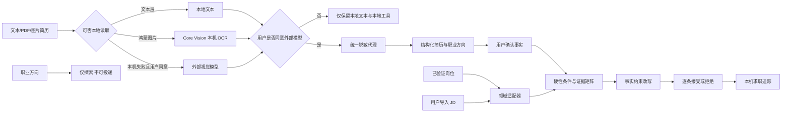

# 架构与竞赛策略

## 1. 聚焦策略

首期深耕四类互联网与数字技术岗位族：软件开发、AI/算法、数据、产品。领域能力通过 `CareerDomainAdapter` 隔离，未来扩展新领域时新增适配器，不把医学、法学等规则硬塞进当前关键词列表。

## 2. 可信业务数据流

## 3. 核心边界

### 岗位边界

- `verified-job`：有官方来源、验证记录和招聘状态。
- `imported-jd`：用户提供的具体岗位文本，状态未知，必须自行核验。
- `career-direction`：模型生成的探索方向，没有投递链接，不能加入投递追踪。

### 匹配边界

- 先处理学历、经验年限等硬性条件，再计算可评估要求的证据覆盖率。
- 证据来源于结构化经历与简历原文，未确认内容只作弱证据。
- 城市偏好、文本长度和固定基础分不能提高专业证据覆盖率。
- 结果只用于材料准备，不代表企业初筛或录用概率。

### 改写边界

- 每条建议保存原文、建议、对应要求、Evidence ID、理由与风险。
- 用户可以编辑、接受或拒绝每一条建议。
- JD 中出现但简历没有证据的技能只进入学习清单。

### 隐私边界

- 外部模型同意只对当前会话生效。
- 手机号、邮箱、详细地址、身份证号和姓名由统一代理脱敏。
- 本机工作区保存简历、修改记录和投递版本；求职追踪单独保存岗位快照、阶段、事件时间和绑定的版本 ID，服务卡片不保存简历正文。
- 一键清除会删除 `kongming.*` 本地求职数据，但不退出设备华为账号。

## 4. 鸿蒙迁移策略

当前选择混合架构是为了严格复用原有 UI 与交互，同时把真正有系统价值的能力逐步下沉原生：

1. 已完成源码与构建：账号、Core Vision OCR、系统分享、Core Speech、Form Kit、相机和麦克风权限。
2. 下一优先级：在支持相应能力的真机上完成账号、OCR、分享、语音和服务卡片完整验收。
3. ArkUI 原生化顺序：岗位卡 → 证据矩阵 → 求职追踪，而不是一次性重写整站。

每个原生能力都必须满足“可构建、可运行、可降级、可说明数据边界”四个退出条件。
